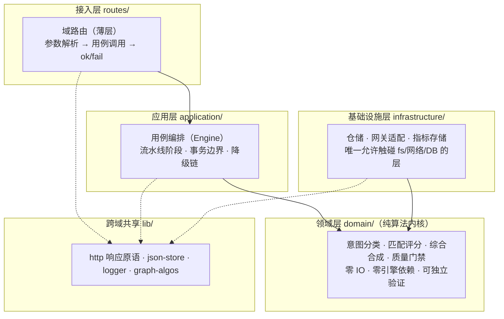

# AINA-STD-001 · AI 第一性原理企业架构规范标准

> **AI-Native Architecture Standard** · v1.0 · 2026-08-22
> 定位：以 AI 为第一性原理（AI as First Principle）的企业级系统架构规范，
> 替代以"人类可读分层"为中心的传统架构范式。本规范为强制标准（Normative），
> 由 `scripts/architecture-guard.js` 自动化门禁执行验证（§7）。

---

## 0. 第一性原理推导

**公设**：软件系统的本质是「请求 → 能力 → 结果」的映射。AI 时代的新变量是：
能力本身可以由模型动态提供、组合方式可以由算法动态决定、质量可以由机器自动验证。

由此推出五条公理（本规范全部条款由五公理派生）：

| # | 公理 | 陈述 | 对应传统概念的颠覆 |
|---|------|------|--------------------|
| A1 | **能力图谱公理** | 一切业务能力建模为图谱节点，边表示委托/降级/流转关系 | MVC 分层 → 图结构 |
| A2 | **意图先行公理** | 任何请求先识别意图（激活扩散），再沿图谱路由到能力，不写死 if-else 分发 | 硬编码路由器 → 意图路由 |
| A3 | **单一真相源公理** | 每个概念（意图模式、图算法、响应原语）全系统只允许一处定义 | 允许复制粘贴 → 唯一定义 + re-export |
| A4 | **依赖单向公理** | 依赖方向恒为 `routes → application → domain ← infrastructure`，引擎之间禁止横向 require | 网状依赖 → 无环单向图 |
| A5 | **机器可验证公理** | 架构规范必须固化为自动化门禁脚本，每次变更可执行验证；纸面规范无效 | 人工评审 → 门禁即代码 |

---

## 1. 分层模型（Layered Model）



**层间规则（Normative）**：

| 规则 | 编号 | 门禁 |
|------|------|------|
| `domain/` 内文件禁止 `require` infrastructure/application/routes/任何引擎 | R1 | G1 |
| `infrastructure/` 禁止 require `application/` | R2 | G1 |
| `routes/` 只允许 require 域门面（`域包/index.js`），禁止直连 infrastructure | R3 | G1 |
| 引擎单例（llm-gateway 等）只允许被 application/infrastructure 引用，禁止被 domain 引用 | R4 | G1 |
| 跨域共享原语只放 `lib/`，且必须无业务语义 | R5 | G3 |

## 2. 域包结构（Domain Package Layout）

每个业务域采用统一的域包结构（以专家联盟为例）：

```
src/expert-alliance/              ← 域包根（目录名 = 域名）
  application/                    ← 用例编排（mixin 用例族模式）
    alliance-orchestrator.js      ← 编排器组合根：装配仓储 + 注入 mixin（≤400 行）
    algorithm-analysis-service.js ← 用例族 mixin：算法分析
    session-service.js            ← 用例族 mixin：会话链/会话消息
    orchestration-proxy.js        ← 用例族 mixin：V2 编排引擎代理
  domain/                         ← 纯算法内核（R1：零 IO）
    intent-patterns.js            ← 意图模式（A3 单一真相源）
    intent-classifier.js          ← 意图分类算法
    expert-matcher.js             ← 专家匹配与评分算法
    debate-synthesis.js           ← 辩论综合算法
  infrastructure/                 ← IO 适配（R2）
    expert-repository.js          ← 专家仓储：CRUD + 种子 + 持久化
    metrics-store.js              ← 指标仓储
    session-chain-store.js        ← 会话链仓储
  index.js                        ← 域门面：组装 + 导出稳定 API
```

**域包解析**：目录内 `index.js` 即解析目标，平级禁止同名 `.js` 文件（否则 require 歧义引发自引用循环）。
**mixin 用例族**：application 单文件超 400 行时，按用例族拆分为 `*-service.js` mixin，
经 `Object.assign(ExpertAlliance.prototype, ...mixin)` 装配，对外方法签名不变（消费方零改动）。
已落地域包：`expert-alliance/`、`kb/`（文档分析/版本 diff 纯算法 + JSON 存储适配）。

**尺寸上限（Normative）**：
- domain/ 单文件 ≤ 400 行（算法可单屏审阅）
- infrastructure/ 单文件 ≤ 400 行
- application/ 单文件 ≤ 400 行（超限按用例族拆 mixin）
- routes/ 单域 ≤ 500 行，超出即拆域包

## 3. 模块化协议（新增域 SOP）

新增一个业务域只需五步（全部可脚本化，AI 可自主执行）：

1. `src/<domain>/domain/*.js` — 写纯算法（输入输出均为值对象）
2. `src/<domain>/infrastructure/*.js` — 写仓储/适配器
3. `src/<domain>/index.js` — 域门面组装
4. `src/routes/<domain>.js` — 薄路由（参数 → 用例 → ok/fail）
5. `src/routes/index.js` DOMAINS 表登记一行 → 重启生效

**验证**：`node scripts/architecture-guard.js` 全绿 + `node scripts/smoke-routes.cjs` 全绿。

## 4. 扩展协议（快速扩展点）

| 扩展场景 | 操作 | 影响面 |
|----------|------|--------|
| 新增专家类型 | `expert-repository.js` 种子表加一行 + `intent-patterns.js` 意图域加关键词 | 2 文件 |
| 新增调度策略 | `expert-dispatcher` STRATEGY_TYPES 注册（已是注册表模式） | 1 文件 |
| 新增流水线阶段 | 联盟引擎阶段表插入（阶段即数据，非控制流） | 1 文件 |
| 新增业务域 | §3 五步 SOP | 0 处既有代码修改 |
| 新增 AI 引擎 | 引擎注册表 + 重跑无穷维度优化自动校准 | 1 文件 + 1 命令 |

**不变式**：扩展只允许"注册"与"新增"，禁止修改既有调用方（开闭原则的机器可验证形式）。

## 5. 统一处理流水线（不变式）

所有请求遵循同一条状态机（已在 §9 business-process-flowcharts.md 定义）：

```
请求 → 鉴权(OUS_API_TOKEN) → match 路由 → 域 handler → 用例编排
     → 意图识别(A2) → 图谱路由 → 执行 → 质量门禁 → ok/fail 统一响应
```

专家联盟六阶段流水线（application 层）：

```
classifyIntent → composeTeam → deliberate → synthesize → qualityGate → learn
```

阶段即数据：每个阶段是 `{name, run, degrade}` 三元组，失败沿降级链单向回退到 chat（A1 的 `degrades_to` 边）。

## 6. AI 第一性 vs 传统架构对比

| 维度 | 传统企业架构 | AINA（本规范） | 收益 |
|------|--------------|----------------|------|
| 组织单元 | 分层（Controller/Service/DAO）给"人"看 | 域包给"算法"消费：能力节点化，AI 可枚举/路由/组合 | AI 自主开发引擎可生成整个域包 |
| 路由方式 | 硬编码路径分发 | 意图识别 + 激活扩散（个性化 PageRank） | 新能力零路由代码自动可达 |
| 复用方式 | copy-paste 或过度抽象 | 单一真相源 + re-export | PageRank 等 7 处重复实现已消除为 1 |
| 质量保障 | 人工评审 + 事后测试 | 门禁即代码（G1-G5），提交前机器验证 | 规范 100% 可执行，0 依赖自觉 |
| 扩展方式 | 修改既有调用链 | 注册表 + 新增文件 | 开闭原则机器可验证 |
| 文档形态 | 与代码漂移的静态文档 | 文档生成自代码 + 门禁断言 | 架构图可追溯到真实实现行号 |
| 优化主体 | 架构师经验驱动 | CEM 交叉熵自动寻优 + 人工裁决 | 配置漂移自动校准 |

**不照搬传统的原因**：传统分层为降低"人类认知负载"设计；AINA 为降低"机器组合成本"设计——
AI 引擎消费的是注册表、图谱边、阶段表这类**可枚举结构**，而非人类可读的目录树。

## 7. 自动化验证门禁（Normative · A5）

门禁脚本：`scripts/architecture-guard.js`，CI/本地均可执行，5 组断言：

| 门禁 | 断言 | 失败示例 |
|------|------|----------|
| G1 依赖方向 | domain 零引擎依赖；infra 不引 application；routes 只引门面 | domain 里 require llm-gateway |
| G2 尺寸上限 | 单文件行数不超 §2 上限 | 上帝类 > 1251 行 |
| G3 真相源唯一 | `pagerank` 仅 lib/graph-algos.js 定义；`INTENT_PATTERNS` 仅 domain/intent-patterns.js 定义 | 域内私藏图算法副本 |
| G4 无环依赖 | require 静态图 BFS 检测环 | a→b→a |
| G5 注册完备 | routes/index.js DOMAINS 表 = routes/ 目录文件集合；域包必有 index.js 门面 | 新建路由未登记 |

执行：`node scripts/architecture-guard.js` → 输出逐项 PASS/FAIL 与违规文件行号。

## 8. 落地记录

| 日期 | 事件 | 验证 |
|------|------|------|
| 2026-08-22 | 专家联盟域包化（§2 结构）+ PageRank 唯一化 + 意图真相源迁域 | 门禁 G1-G5 全绿；冒烟 26/26；公式 35/35；架构 21/21 |
| 2026-08-22 | alliance-orchestrator 收敛为 mixin 组合根（802→395 行：算法分析/会话/V2 编排三个用例族）+ 补 `_detectIntent` 等历史契约委托 | 门禁全绿；架构 21/21 |
| 2026-08-22 | kb 域包化：routes/kb.js 517→371 行，纯算法（文档分析/LCS diff）下沉 domain，JSON 存储下沉 infrastructure | 门禁全绿；冒烟 26/26（含 /kb/stats） |

---

*本规范由 `architecture-guard.js` 强制执行；修改规范必须同步修改门禁断言（A5：纸面变更无效）。*
