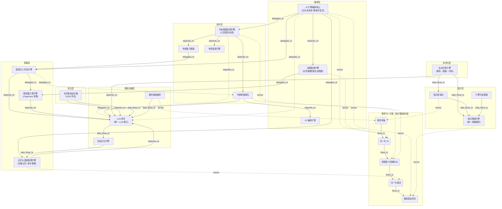
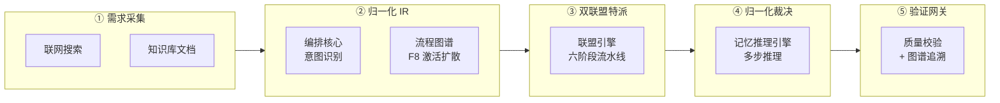

# 引擎宇宙图谱（Engine Universe Graph）

> 技术图谱管理所有引擎链接的唯一权威文档 · AINA-STD-001 §9
> 实现：`platform/backend-node/src/engine-universe/` · API：`/engine-universe/*`
> 验证：`node test/test-engine-universe.js`（40/40）· `GET /engine-universe/verify`（113 项检查）

---

## 1. 核心命题：独立引擎如何协同

全部 17 个引擎各自独立开发、独立演进，但**技术图谱管理所有的链接**——
每个引擎是一张图上的节点，引擎间的依赖/委托/降级/数据流/服务关系是显式的边，
**关联关系可直接查询**（BFS 链路追踪），**全链路打通可机器验证**（113 项自动检查）。

- **18 引擎节点**（17 引擎 + 引擎宇宙自身自举）· **5 需求归一化链节点** · **42 关联边**
- 边类型 6 类：`depends_on`（依赖）/ `delegates_to`（委托）/ `degrades_to`（降级）/ `data_flows_to`（数据流）/ `serves`（服务需求）/ `flows_to`（需求链流转）
- 全域单一连通分量（无孤岛）：任何引擎都能沿关联边到达任何其他引擎

## 2. 引擎分层与最关键功能

### 基础设施层

| 引擎 | 最关键功能 |
|------|-----------|
| **LLM 网关** `llm-gateway` | ① 多 AI 引擎接入（OpenAI/Claude/豆包/千问/Kimi/DeepSeek/智谱/Gemini）+ 密钥加密管理；② 自动优选激活引擎；③ **全系统唯一 LLM 调用收口**（实时日期注入 + 联网搜索上下文注入） |
| **联网搜索服务** `web-search-service` | ① 多搜索引擎接入（Bing 默认）；② 统一 search() + 引用来源结构化返回；③ 搜索上下文注入 LLM 网关 |
| **会话记忆引擎** `session-store` | ① 会话持久化与生命周期管理；② 历史问题向量索引 + 语义检索召回；③ AI 对话记忆底座（"之前说过"类问题的数据源） |

### 编排层

| 引擎 | 最关键功能 |
|------|-----------|
| **AI 引擎统一编排核心** `ai-engine-core` | ① 五步流水线收口：意图识别（激活扩散）→ 能力路由 → 引擎执行 → 质量校验 → 指标反馈；② 能力矩阵自描述（expert/reasoning/memory/graph/workflow/chat）；③ **降级不变式：任何失败单向降级 chat，请求绝不空手而归** |
| **V2 编排引擎** `orchestration-engine` | ① 插件化编排（planner/executor/reflector 流水线）；② runTurn 事务化 + 检查点回放；③ 联盟 V2 代理底座 |
| **流程图谱引擎** `ai-flow-graph` | ① **业务流程图 + 数据流程图 + 算法流程图统一承载**（step/keyword/capability/engine 四类节点）；② 四类关系边（flows_to/triggers/delegates_to/degrades_to 降级链显式建模）；③ F8 激活扩散意图识别（个性化 PageRank 特例） |

### 智能层

| 引擎 | 最关键功能 |
|------|-----------|
| **记忆与深度推理引擎** `ultimate-ai-engine` | ① VectorMemoryStore 向量记忆（embedding/持久化/语义检索）；② ReasoningEngine 多步推理（逐步推演 + 洞察提取 + 置信度）；③ 归一化裁决（需求链终端承接） |
| **图谱与工作流引擎** `ai-engine` | ① 图谱分析（统计 + PageRank + 社区 + 中心性 + AI 结论）；② 工作流顺序执行（关键步中断保护）；③ PageRank 单源委托图智能引擎 |
| **图智能计算引擎** `ai-integration-engine` | ① **个性化 PageRank 统一实现**（全系统唯一定义）；② 符号图构建 + token 预算裁剪；③ 激活扩散底座 |

### 协作层

| 引擎 | 最关键功能 |
|------|-----------|
| **专家联盟处理引擎** `expert-alliance-engine` | ① 六阶段流水线：意图→组队→辩论→综合→质量闸门→学习；② 多目标最优组队（能力匹配 + 图谱协同增益 + 负载均衡）；③ 辩论收敛（加权表决 + 共识度 + 少数派保留） |
| **专家联盟域包** `expert-alliance` | ① 专家全生命周期（15 专家多类型）；② 咨询编排（单专家/多专家并行/多轮辩论）；③ 会话链（顺序链上下文传递 + 并行链） |
| **专家能力图谱引擎** `expert-graph` | ① 三级建边（包含式强边 + 2-gram 语义邻接 + 相似关联）；② CNM 模块度社区检测（专家聚类）；③ 协同增益计算 |
| **专家调度引擎** `expert-dispatcher` | ① 注册表式调度策略（负载均衡/能力优先/历史成功率）；② 专家运行时指标 |

### 自动化层

| 引擎 | 最关键功能 |
|------|-----------|
| **自动开发引擎** `auto-dev-engine` | ① **全自动开发流水线：需求 → LLM 生成架构图谱 JSON → 规范校验 → 确定性代码渲染 → 安全落盘 → 预览**；② LLM 只生成架构图谱，代码由确定性渲染器输出（可校验可复现无幻觉）；③ 安全边界（路径逃逸/编码逃逸校验） |

### 优化层

| 引擎 | 最关键功能 |
|------|-----------|
| **无穷维度优化引擎** `infinite-dimension-optimizer` | ① CEM 交叉熵高维寻优（温度/路由强度/上下文深度/引擎权重）；② 多目标加权评分（0.55 质量 + 0.20 速度 + 0.10 token + 0.15 稳定性）；③ σ̄<0.06 或 3 轮无改进收敛，最优配置持久化生效 |

### 知识层

| 引擎 | 最关键功能 |
|------|-----------|
| **知识库域包** `kb` | ① 文档全生命周期（CRUD + 版本快照 + LCS diff + 软删除）；② 文档智能分析（实体抽取/关键词/分类建议）；③ 图谱关联（文档实体与图谱节点互链） |
| **知识图谱引擎** `knowledge-graph` | ① **图谱数据中枢**（graph_nodes/graph_edges 统一存储 + CRUD + 检索）；② 图算法库（PageRank/Brandes 介数/LPA 社区/激活扩散）；③ **技术图谱管理所有链接的统一承载底座** |
| **引擎宇宙图谱** `engine-universe` | ① 全系统引擎节点化权威定义；② 关联关系显式建模可直接查询；③ 全链路验证（代码路径/需求链/降级链/连通性） |

## 3. 引擎宇宙总览图（Mermaid）



实线 = depends_on/delegates_to/data_flows_to；虚线 = degrades_to（降级）/ serves（服务需求）。

## 4. 需求归一化链（与知识图谱 n_* 节点严格对应）



**归一化的含义**：任何形态的需求（对话/文档/搜索结果）进入链路后，
第一步就被编排核心 + 流程图谱归一化为**能力 IR**（expert/reasoning/memory/graph/workflow/chat），
后续每一环只消费 IR——这是全系统"归一化设计"的根基。

## 5. 全链路验证（机器可验证，A5 公理）

`GET /engine-universe/verify` 每次执行 **113 项检查**：

| 类别 | 检查内容 | 数量 |
|------|---------|------|
| V1 代码路径存在性 | 每个引擎声明的 codePath + 协作文件真实存在于代码库 | 57 |
| V2 边完整性 | 每条关联边两端节点必须在注册表中定义 | 42 |
| V3 需求链连通性 | n_ingest→n_gate 沿 flows_to 可达 + 每环有引擎服务 | 6 |
| V4 降级链收敛性 | 所有 degrades_to 链收敛到 llm-gateway（chat 兜底不变式） | 1 |
| V5 能力承接完备 | 六大能力各有承接引擎 | 6 |
| V6 全域连通无孤岛 | 引擎宇宙单一连通分量（技术图谱管理所有链接） | 1 |

**开发新代码后先验证全链路是否打通**：

```bash
node test/test-engine-universe.js      # 40 项测试
curl http://localhost:3010/engine-universe/verify   # 113 项运行时检查
```

## 6. API 一览

| 端点 | 功能 |
|------|------|
| `GET /engine-universe` | 完整引擎宇宙图谱（23 节点 + 42 边 + 度统计 + 分层清单） |
| `GET /engine-universe/engines` | 引擎清单（含关键功能描述，支持 category/capability 过滤） |
| `GET /engine-universe/engines/:id` | 单引擎详情：上下游关系 + 服务需求 + 代码文件 |
| `GET /engine-universe/trace?from=A&to=B` | BFS 链路追踪（支持 type 边类型过滤） |
| `GET /engine-universe/requirement-chain` | 需求归一化链每环的服务引擎 |
| `GET /engine-universe/verify` | 全链路验证报告（113 项） |

## 7. 扩展方式（AI 自动写代码/写需求的接入点）

新增引擎三步（域包模式，AINA-STD-001 §5）：

1. **注册表登记**：在 `engine-universe/domain/engine-registry.js` 增加节点（id/name/keyFunctions/codePath/capabilities）
2. **关系建边**：在 `relation-registry.js` 声明 depends_on/delegates_to/degrades_to/serves 边
3. **代码路径关联**：CODE_ASSOCIATIONS 登记协作文件 → 运行 verify 立即校验

自动开发引擎（auto-dev-engine）生成的架构图谱同样落入知识图谱统一管理——
**AI 写的代码、AI 写的需求、人写的代码，全部在技术图谱上同构管理**。

## 8. 落地记录

| 日期 | 事件 | 验证 |
|------|------|------|
| 2026-08-22 | 引擎宇宙图谱域包落地：17 引擎节点化 + 5 需求链节点 + 42 关联边（6 类） | 引擎宇宙测试 40/40；运行时 verify 113 项全过；门禁 G1-G5 全绿；冒烟 26/26 |
