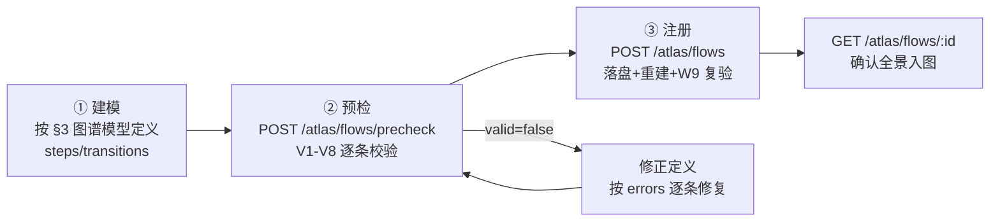

# EAF-STD-001 通用 AI 知识图谱专家联盟业务处理流程行业规范标准

> **文档编号**：EA-DOC-063 ｜ **权威等级**：🟢权威 ｜ **最后更新**：2026-08-31
>
> Expert Alliance Flow Standard —— 专家联盟业务处理流程规范（行业级）
> 版本：V1.2 · 2026-08-22（V1.2 新增：SSE 流式对话契约 / MCP 标准协议暴露；
> V1.1 新增：门禁重试闭环 / 安全强制组队 / trace 审计回溯 / 学习技能沉淀 / 降级链#1 显式实现）
> 参考实现：`flow-ea-consult`（本项目专家联盟咨询主流程，六阶段全链路）
> 机器验证：`GET /atlas/verify` W9 检查族（252 项无破窗验证的组成部分）
> 专项测试：`test/test-expert-alliance-enterprise.js`（34 项企业级能力验证）

---

## 1. 标准定位

本标准定义**在通用 AI 知识图谱之上构建专家联盟系统**的业务处理流程规范，适用于：

- 多专家协同咨询类系统（智能路由、组队、辩论、综合）
- 以知识图谱为基础设施的 AI 引擎编排系统
- 需要银行级韧性（不宕机、可降级、可回滚）的企业级 AI 服务

核心命题：**图谱即专家联盟的流程基础设施**。专家联盟的每一次咨询都是图谱上
一次可追溯的流程执行：步骤（step）是节点，流转（flows_to / degrades_to）是边，
专家、引擎、数据资产是图谱中的协作资源。任何模块按本标准建模后，即可被
项目全息图谱统一承载、验证与治理。

## 2. 术语定义

| 术语 | 定义 |
|---|---|
| 业务流程（Flow） | 一个业务目标的完整步骤序列，含主干与降级路径 |
| 步骤（Step） | 流程的原子执行单元，必须委托唯一引擎执行 |
| 主干（Main Path） | `next` 边串联的常态执行路径 |
| 降级链（Degrade Path） | `degrade` 边声明的韧性备用路径，主路径不可用时启用 |
| 委托（Delegation） | 步骤与引擎的执行关系（`delegates_to` 边） |
| 六阶段 | 意图识别 → 最优组队 → 并行咨询与辩论 → 综合合成 → 质量门禁 → 反馈学习 |

## 3. 图谱模型规范

### 3.1 节点类型

| 节点 | 语义 | 图谱 kind |
|---|---|---|
| 步骤节点 | 流程原子执行单元 | `flow_step` |
| 域节点 | 业务流程归属的业务域 | `domain` |
| 引擎节点 | 步骤委托的执行者（引擎/专家类型） | `engine` |
| 数据节点 | 步骤读写的数据资产 | `data` |

### 3.2 边类型（四类迁移 + 三类关系）

| 边 | 方向 | 语义 |
|---|---|---|
| `next_step` | step → step | 主干顺序流转 |
| `degrades_to` | step → step | 降级链（韧性备用路径） |
| `flow_of` | step → domain | 步骤归属流程域 |
| `delegates_to` | step → engine | 步骤委托引擎执行 |
| `reads` / `writes` | step → data | 步骤数据读写依赖 |

### 3.3 建模不变式

1. 每条流程**归属且仅归属一个业务域**（`flow_of` 全部指向同一 domain）。
2. 每个步骤**必须委托真实存在的引擎**（`delegates_to` 指向引擎注册表真实节点）。
3. 每条流程**步骤数 ≥3** 且步骤 id 在流程内唯一。
4. 每条流程**存在入口**（无 `next_step`/`degrades_to` 入边的步骤）或为
   **闭环流程**（巡检/循环类，以首步为锚点）；从入口/锚点出发必须可达全部步骤。
5. 步骤声明的数据读写**必须指向已注册数据资产**（防幽灵引用）。

## 4. 六阶段处理流程规范（标准级流程）

### 阶段零（前置守卫）：空问题快速失败

- 空输入必须在 **<100ms** 内拒绝，不得进入全管线。
- 拒绝响应携带机器可读错误码与 trace 结构。

### 阶段一：意图识别

- 输入：用户问题（自然语言）。
- 算法：关键词模式匹配 + 意图先验反馈（历史咨询统计）。
- 输出：`{ primary, confidence, candidates }`。
- 约束：意图分类必须覆盖安全类关键词（注入/XSS/CSRF/越权/脱敏等），
  安全类问题的识别置信度不得低于通用类。

### 阶段二：最优组队

- 输入：问题 + 意图 + 专家注册表 + 专家能力图。
- 算法：专家匹配打分（能力/类型/指标）+ 协同增益（能力图协同度）。
- 输出：`{ team, team_size, total_synergy, security_note }`。
- 约束：**安全类问题必须优先选择安全专家入队**——常规评分未选入时
  强制替换末位成员保规模；注册表无安全专家时显式记录 `security_note`
  （不静默）。组队失败快速返回明确错误。

### 阶段三：并行咨询 + 自适应辩论

- 输入：问题 + 团队 + 业务上下文。
- 算法：多专家并行咨询 + 逐轮辩论收敛检测。
- 韧性约束（必须全部实现）：
  1. **自适应辩论跳过**：初始共识 ≥0.6 时跳过辩论轮（降低延迟）；
  2. **逐轮收敛检测**：达阈值后提前终止辩论；
  3. **辩论令牌上限**：单轮辩论 ≤900 令牌（控资源）；
  4. **超时隔离**：单专家处理超时（60s）即隔离，不得阻断整条管线；
  5. **分歧保留**：未达共识时保留分歧进入综合，不得强行表决。
- 输出：`{ rounds, consensus: { agreements, divergences, validCount }, opinions }`。

### 阶段四：综合合成

- 输入：辩论结果 + 意图 + 上下文。
- 算法：共识提取（agreements）+ 分歧结构化（divergences）+ 最终建议生成。
- 输出：`{ summary, recommendation, confidence, ai_powered }`。

### 阶段五：质量门禁

- 校验维度：置信度下限、有效意见数下限、意图一致性。
- 输出分级：`{ level, passed, reasons }`（不通过时说明原因，不静默放行）。
- **C 级重试闭环（V1.1）**：`retry_suggested` 必须被主流程真实消费——
  C 级触发**单次**重路由组队（换血：排除首次团队）重跑阶段三~五，
  取门禁更优者（A > B > C > D）；重试结果不更优则保留首次结果。
  重试全程记录于 trace `retry` 字段（attempted / gate_first / gate_retry / adopted）。

### 阶段六：反馈学习

- 意图先验更新（强化正确路由）+ 学习技能沉淀。
- **学习技能沉淀（V1.1）**：仅质量门禁 `passed` 的处理沉淀技能；
  技能键 = 意图 + 团队签名（类型集合），同键重复出现强化（count+1、
  置信度平滑）而非新增记录；持久化至 `alliance_learned_skills.json`
  （独立于智能集成引擎的 `learned_skills.json`，互不覆写），容量上限
  200 条按弱淘汰。
- **原子写（V1.1）**：先验与技能落盘必须 tmp + rename，崩溃不产生半写文件。
- 全程 trace 落盘（六阶段时序 + 耗时 + 结论），供审计与回归。

### 降级链（标准要求 ≥2 条）

| 主路径 | 降级路径 | 触发条件 | 回归点 |
|---|---|---|---|
| 并行咨询+辩论 | 单专家直答 | 咨询/辩论引擎不可用 | 质量门禁 |
| LLM 综合合成 | 启发式综合（关键词重叠） | LLM 网关不可用 | 质量门禁 |

降级路径执行后**必须回归主流**的后续阶段（质量门禁），保证输出契约一致。

**降级链#1 显式实现（V1.1）**：两级触发——
1. 初始轮全部专家失败（咨询引擎不可用）→ 单专家直答重试一次
   （团队首位 + 精简上下文），仍失败则保留失败结果回归主流；
2. 辩论轮全部专家失败（辩论引擎不可用）→ 回退初始轮直答形态
   （保住有效意见，不被全失败结果覆盖）。
降级在 `deliberation.degraded` 显式标记（from / to / reason），
轮次明细 `rounds_detail` 含降级轮记录，供 trace 审计。

### 审计与可观测（V1.1）

- **trace 回溯**：`GET /experts/alliance/traces/:traceId` 按 id 精确回查
  任何一次咨询（窗口：最近 200 条 / 2MB）。
- **轨迹列表**：`GET /experts/alliance/traces?limit=N` 最近轨迹倒序。
- **聚合统计**：`GET /experts/alliance/traces/stats`——成功率、平均/p95
  耗时、门禁级别分布、意图分布。
- **技能视图**：`GET /experts/alliance/skills`——学习技能排行与统计。

## 5. 机器可验证检查项（W9 映射 + V1-V8 校验）

本标准的每条规范均可被 `GET /atlas/verify` 的 W9 检查族机器验证：

| 检查项 | 规范条款 |
|---|---|
| 流程 id 全局唯一（代码基线 + 运行时注册层） | 3.3 补充 |
| 流程归属域存在 | 3.3-1 |
| 步骤数 ≥3 且 id 唯一 | 3.3-3 |
| 迁移边引用有效 | 3.3-4 |
| 步骤委托引擎真实存在 | 3.3-2 |
| 步骤数据读写已注册 | 3.3-5 |
| 入口/闭环存在且全步骤可达 | 3.3-4 |
| 核心域流程全覆盖 | 第 4 章标准级要求 |
| EAF-STD-001 参考实现六阶段完整 | 第 4 章 |

### 5.1 注册前校验（V1-V8 建模不变式）

任何流程在注册（`POST /atlas/flows`）或预检（`POST /atlas/flows/precheck`）时，
必须通过 `flow-validator`（domain 层纯函数，零 IO）的八条不变式校验：

| 规则 | 校验内容 | 对应规范条款 |
|---|---|---|
| V1 流程身份 | id 非空、格式合法（`^[a-z][a-z0-9-]*$`）、不与既有流程冲突（除非覆盖语义）；name 必填 | 3.3-3 |
| V2 归属唯一 | domain 必须指向图谱真实业务域（含运行时 auto 层） | 3.3-1 |
| V3 步骤结构 | steps ≥3、id 流程内唯一、每步有名称 | 3.3-3 |
| V4 迁移有效 | transitions 引用的步骤必须存在；迁移边数 ≥ 步骤数-1 | 3.3-4 前置 |
| V5 委托真实 | 每步 engine（若声明）必须指向引擎注册表真实节点 | 3.3-2 |
| V6 数据注册 | reads/writes 必须指向已注册数据资产（防幽灵引用） | 3.3-5 |
| V7 连通可达 | 存在入口或为闭环，入口/锚点 BFS 可达全部步骤 | 3.3-4 |
| V8 迁移类型 | type ∈ {next, degrade} | 3.2 |

校验输出 `{ valid, errors: [{rule, message}] }`——拒绝时逐条指名，不静默放行。

## 6. API 契约

### 6.1 查询契约

| 端点 | 方法 | 语义 |
|---|---|---|
| `/atlas/flows` | GET | 全系统流程清单（步骤数/降级数/关联域/标准锚点） |
| `/atlas/flows/:id` | GET | 单流程全景（步骤链/委托引擎/数据读写/降级链） |
| `/atlas/verify` | GET | 无破窗验证（含 W9 流程检查族） |

### 6.2 注册契约（运行时接入）

| 端点 | 方法 | 语义 |
|---|---|---|
| `/atlas/flows/precheck` | POST | 预检：V1-V8 建模不变式校验，**不落盘**（接入方自助检查） |
| `/atlas/flows` | POST | 注册：校验→持久化→图谱重建→W9 复验（失败返回 400 + 逐条错误） |
| `/atlas/flows/:id` | DELETE | 移除：仅运行时注册流程可移除；代码基线流程 404（保护基线） |

**注册请求体**（`POST /atlas/flows`）：

```json
{
  "overwrite": false,
  "flow": {
    "id": "flow-my-module-main",
    "name": "我的模块主流程",
    "domain": "my-module",
    "standard": "EAF-STD-001",
    "steps": [
      { "id": "s1", "name": "接收输入", "engine": "my-engine", "reads": ["my_data.json"] },
      { "id": "s2", "name": "核心处理", "engine": "my-engine", "writes": ["my_out.json"] },
      { "id": "s3", "name": "输出归一", "engine": "my-engine" }
    ],
    "transitions": [
      { "from": "s1", "to": "s2", "type": "next" },
      { "from": "s2", "to": "s3", "type": "next" }
    ]
  }
}
```

**注册语义**：

- 同 id 默认拒绝（幂等保护）；`overwrite: true` 覆盖更新（移除旧条目再写入）。
- 注册成功即触发 **W9 全量复验**——注册不得引入破窗，复验失败立即暴露。
- 持久化至运行时层（`data/atlas_auto_registry.json` flows 键），服务重启后自动恢复。
- 代码基线（`flow-registry.js`）为不可变层，运行时注册流程带 `runtime: true` 标记。

## 7. 模块接入 SOP（三步接入图谱）

任何模块按以下步骤将业务流程接入通用 AI 知识图谱：



1. **建模**：按 §3 图谱模型规范定义流程（id/name/domain/steps/transitions），
   步骤委托引擎、读写数据必须使用图谱既有资产 id。
2. **预检**：`POST /atlas/flows/precheck` 自助校验（不落盘），
   按 `errors` 逐条修复至 `valid: true`。
3. **注册**：`POST /atlas/flows` 正式注册（同 id 更新传 `overwrite: true`），
   注册响应携带 W9 复验结果（`verification.ok` 必须为 true）。

**版本演进**：流程定义变更即重新注册（覆盖语义）；下线流程用 `DELETE /atlas/flows/:id`
移除（仅运行时注册流程可移除）。

## 8. 参考实现

本项目 `flow-ea-consult`（专家联盟咨询主流程）为本标准的完整参考实现：

- 10 步（前置守卫 + 六阶段 + 归一化输出 + 2 条降级路径）
- 11 条迁移边（8 主干 next + 2 降级 degrade + 2 降级回归 next）
- 委托 4 个引擎（expert-alliance-engine / expert-graph / llm-gateway / expert-alliance）
- 数据读写 6 项（intent_priors / experts / capability_graph / alliance_learned_skills / traces / 调度配置）
- 实现代码：`src/expert-alliance-engine.js`（六阶段流水线）
  - 技能沉淀 domain 纯函数：`src/expert-alliance/domain/skill-synthesis.js`
  - 技能仓储（原子写）：`src/expert-alliance/infrastructure/skill-store.js`
- 流程注册：`src/project-atlas/domain/flow-registry.js`（代码基线层）
- 企业级专项测试：`test/test-expert-alliance-enterprise.js`（34 项）

**注册基础设施**（其他模块接入用）：

- 不变式校验：`src/project-atlas/domain/flow-validator.js`（V1-V8 纯函数）
- 注册用例：`src/project-atlas/application/flow-registration-service.js`
  （校验→持久化→图谱重建→W9 复验，依赖注入可测）
- 路由端点：`src/routes/atlas.js`（precheck / POST / DELETE）

## 9. 对外协议暴露（V1.2）：SSE 流式与 MCP 标准工具

专家联盟的六阶段能力通过两种行业标准协议对外暴露，供任意外部客户端
（Web 前端 / Claude Code / Cursor / 自研 Agent）零适配接入。

### 9.1 SSE 流式对话契约（`POST /ai/chat/stream`）

| 约束 | 规范 |
|---|---|
| 传输 | `text/event-stream`（`no-cache` / `no-transform` / `X-Accel-Buffering: no`） |
| 事件序列 | `start`（会话锚定）→ `delta`×N（增量分片）→ `done`（usage/model/ai_powered 收口）或 `error` |
| 心跳 | 15s 注释行 `: keep-alive`（防中间层空闲断连） |
| 中断语义 | 客户端断开即 `AbortController` 上游取消（不空耗 token），会话记忆保持一致 |
| 记忆兼容 | 与非流式 `POST /ai/chat` 共享同一会话记忆（LRU 上下文） |
| 真实性 | `done` 事件携带 provider 原生 `usage`（prompt/completion tokens），可审计 |

实现：`src/llm-gateway.js#chatStream`（chunk 解析 + usage 累计 + 中断传播）、
`src/routes/chat.js`（SSE 端点）。专项测试：`test/test-sse-stream.js`
（首 token 延迟 < 总时长、分片 >10、内容完整性）。

### 9.2 MCP 标准协议（`POST /mcp`，JSON-RPC 2.0）

| 方法 | 语义 |
|---|---|
| `initialize` | 协议握手（protocolVersion / serverInfo / capabilities） |
| `tools/list` | 七大工具自描述（JSON Schema 输入校验） |
| `tools/call` | 工具执行（content-text 返回，`isError` 显式失败标记） |
| `ping` | 探活 |

**七大工具**（专家联盟六阶段能力的标准封装）：

| 工具 | 映射阶段 |
|---|---|
| `list_experts` | 专家注册表查询 |
| `classify_intent` | 阶段一：意图识别 |
| `compose_team` | 阶段二：最优组队 |
| `consult_expert` | 阶段三：单专家咨询 |
| `alliance_deliberate` | 阶段三~五：辩论+综合+门禁 |
| `alliance_process` | 六阶段全流水线（安全类问题强制安全专家入队） |
| `alliance_traces_stats` | trace 审计回溯与聚合统计 |

协议合规：批量请求（数组）、通知（无 id → 202 无响应体）、
`-32700/-32601/-32602` 标准错误码。实现：
`src/mcp/domain/tool-definitions.js`（工具 schema）、
`src/mcp/application/mcp-orchestrator.js`（JSON-RPC 编排）、
`src/routes/mcp.js`（传输端点）。专项测试：`test/test-mcp-protocol.js`。

## 10. 与其他标准的关系

- 依赖 AINA-STD-001（AI 原生架构标准：域包模式/分层契约）
- 依赖项目全息图谱（project-atlas：节点/边承载与无破窗验证）
- 对齐 ai-flow-graph 边规范（triggers/flows_to/delegates_to/degrades_to）
- 供引擎内核（engine-kernel）槽位切换标准引用（流程步骤委托可插拔引擎）
- §9 对外协议暴露对齐 MCP 官方规范与 SSE W3C 规范（业界智能体中心互操作基线）

---

*本标准由璇玑系统自研并机器验证，遵循"一切皆项目、一切可图谱化、一切可插拔"三原则。*
