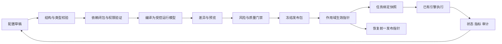

# LC-STD-001 企业级低代码与全维动态配置规范

> 版本V1.0 · 2026-10-01 · 状态：目标规范，待实施评审。
> 职责：本文件统一定义配置语义、维度、版本、约束与验收。运行现状继续由各主题来源裁决；不宣称已存在通用配置中心或完整热发布。

## 1. 范围与产品原则

新业务优先复用基座、领域能力和行业包，标准CRUD采用元数据/页面配置，业务步骤采用受控流程，复杂算法或外部操作采用已注册领域能力。低代码优先级：复用现有模块→配置既有能力→扩展一个通用适配器→新增确有必要的领域代码。

“全维”是所有业务配置类别都有模型、所有权、依赖和发布机制；不是把安全算法、任意程序、数据库DDL或所有基础设施参数都变成随时可执行的用户配置。不同配置明确标记立即生效、下一次任务生效、需要重新装配、需要迁移或需要重启。

遵循 `docs/architecture/MOX-MODULE-COMPOSITION-v1.md#模块边界` 和 `docs/database/mox_sys/module-contract.md#1-模块边界`。业务状态/授权/预算由后端执行；前端配置只改善呈现。既有字典采用适配映射，不强改所有域的状态码或主键格式。

## 2. 全维配置矩阵（LC-D01–20）

| ID | 配置维度 | 受控内容与拥有者 | 生效边界与验证 |
|---|---|---|---|
| D01 | 产品/行业包 | pack_id、依赖、安装组合；产品/meta | 包依赖闭包、许可和契约兼容；发布引用冻结 |
| D02 | 模块装配 | 已注册module_id、required、契约版本；宿主 | 复用现有manifest；不能配置任意库或路由抢占 |
| D03 | 实体与关系 | 字段、约束、关系、索引意图；meta/owner域 | 结构变更需要迁移；别域表不可写 |
| D04 | 查询与命令 | query_id/command_id、参数映射；API/DSQL | 引用已发布参数化能力，不接收用户SQL拼接 |
| D05 | 页面与组件 | 表单、列表、详情、布局、控件；frontend | 白名单组件、类型绑定、无运行时JS编译 |
| D06 | 导航与动作 | 页面标识、动作标识、排序、可见条件；frontend | 只引用已注册页面/动作；可见性不代替授权 |
| D07 | 字典与格式 | 值/标签、单位、locale、时区；meta/标准 | 字典版本化；日期格式经项目统一出口 |
| D08 | 校验与计算 | 必填、范围、表达式、派生值；meta/领域 | 受限表达式、时间/复杂度限制、服务端复验 |
| D09 | 流程与状态 | 节点、转移、输入输出、审批意图；flow | 计划验证、已注册节点；审批持久化另验 |
| D10 | 事件与定时 | trigger_ref、周期、去重、运行窗口；宿主/flow | 注册能力、明确时区/错过策略、事件循环防护 |
| D11 | 身份与组织 | 组织映射、身份提供方引用；IAM | 受保护管理操作；禁客户端覆盖身份 |
| D12 | 权限与数据范围 | 资源动作、范围、角色绑定；IAM/owner域 | deny优先、域主源授权、跨租户负向用例 |
| D13 | 专家与匹配 | 能力、匹配权重、候选策略；alliance | health/availability/状态分离；合法权重与版本 |
| D14 | 模型与提示词 | provider_ref、prompt_ref、模型参数；ai/alliance | 能力兼容、敏感数据策略、secret_ref仅引用 |
| D15 | 工具与连接器 | tool_id、connector_ref、目标映射；适配owner | 网络允许清单、身份范围、超时与幂等语义 |
| D16 | 资源与预算 | 并发、队列、tokens、花费、重试；宿主/执行 | 有界接纳；并发与QPS分别限制；不得提高宿主上限 |
| D17 | 知识与图谱 | 索引策略、来源关系、检索参数；kg/kb | 资源授权、可重建投影、删除与保留传播 |
| D18 | 通知与运营 | 模板、触达渠道引用、仪表板；通知/运营 | 收件范围、脱敏、去重、失败可见 |
| D19 | 部署与存储 | 部署档、存储适配引用、保留等级；运维/数据 | 配置引用不能代替真实部署/备份；迁移受控 |
| D20 | 质量与发布 | 验收场景、门禁、灰度、回滚；发布/开发联盟 | 策略可选择既有门禁，不得禁用安全红线 |

每个维度必须有配置schema、owner、依赖、作用域、变更风险、生效方式、观测和验收。暂不支持的能力标unsupported，不把缺少字段默认为能力已开启。

## 3. 统一配置对象与版本

通用逻辑信封：config_id、kind、schema_version、owner_module、scope、revision、status、spec、dependency_refs、checksum、change_reason。控制面设置身份/时间/审核信息，客户端不能伪造。schema_version描述结构契约，revision描述配置内容版本，release_id描述一组共同发布的版本闭包，三者分别管理。

scope包含环境、租户和可选项目/业务包。env不得混入tenant_id；平台模板与租户覆盖分别存储，租户只能覆盖schema明确允许的字段。秘密使用secret_ref，不纳入明文配置导出、页面回显或日志。执行快照保留实际使用的引用版本与摘要，密钥解析按受控生命周期，不固化明文。

配置归一化采用稳定字段序列化、排序的集合、明确空值规则、版本化schema与哈希。顺序有业务语义的数组保持原顺序；同一对象的哈希不得因展示顺序变化而改变，流程顺序变化必须改变哈希。

## 4. 作用域继承与约束合成

目标解析顺序：平台默认→行业包→环境→租户→项目→任务允许的覆盖。模板版本固定，不按“最新”隐式跟随。

覆盖以schema定义为准：标量可替换；对象只合并白名单路径；数组默认整体替换，只有声明主键与操作语义后才支持按元素合并；null不默认为删除，删除使用显式tombstone。未知字段、重复键、类型漂移、非法引用拒绝。运行输入是数据，不自动当配置patch。

覆盖不得越过安全边界：资源预算按宿主、环境、租户、项目、任务限额取约束交集；允许网络目标/工具权限取交集；显式deny优先。租户/任务不能扩张平台权限。普通默认可被覆盖，安全上限不能被同一合并算法覆盖。

解析输出包含effective_spec、config_sources、field_origins、resolved_dependencies、release_id和checksum，能回答每个重要值来自哪一层。配置冲突报具体字段与两方来源，不静默选择。

## 5. 编制、发布与运行闭环

目标编辑态Draft→Validated→Approved→Published→Deprecated；发布包发布后不可修改。Rejected为审核结果，不伪装成业务任务失败。作用域的发布选择指针独立管理，灰度使用稳定租户/项目分组，不在一个任务执行过程中逐请求随机选版本。

运行任务绑定release_id与计划版本；新配置默认只影响新任务。影响正在运行任务的迁移必须显式规定安全检查点、状态转换与回执。生效指针事务更新+缓存版本验证；“回滚配置”不等于回滚DDL、已发通知或外部副作用，涉及数据的回滚走迁移/补偿。

## 6. 全面与高效的工程实现

编制成本放在控制面：一次验证、一次依赖解析和编译，生成不可变执行包；运行面只做身份、资源授权、版本选择、预算接纳和已注册能力调用。缓存键包含scope、release_id、schema/compiler版本；执行中的任务持有快照，缓存淘汰不能改变结果语义。

优先共享底层类型/字典/校验器与解析规则，不强制所有UI页面共享一个复杂schema。基础CRUD用通用页面；复杂交互使用注册组件/专用页面适配，不强迫任何业务零代码。配置导出为可diff的文本，秘密分离，支持私有离线包，包清单与校验和固定。

容量按配置大小、依赖数、页面控件数、流程节点数、运行并发档设置限制和基准；未做测量前不承诺秒级生成、百万并发或比代码快若干倍。每次发布记录编译耗时、包体积、命中率和执行开销，与同场景旧版比较。

## 7. 企业级验收矩阵

| ID | 场景与通过条件 | 证据 |
|---|---|---|
| LC-Q01 | 同输入与同编译版本产生相同有效配置及checksum | 确定性样本/结果对比 |
| LC-Q02 | 租户覆盖越权字段、任务抬预算、未知能力：拒绝并给出字段来源 | 正反作用域与授权用例 |
| LC-Q03 | 函数字符串、表达式注入、用户SQL、外部URL绕过：不能执行 | 非法输入、依赖与网络负向样本 |
| LC-Q04 | 一组页面/流程/字典版本原子发布；并发生效冲突不出现半包 | 乐观锁、发布闭包、故障注入 |
| LC-Q05 | 发布中旧任务仍用旧快照，新任务可见新版本 | 多版本并发执行回执 |
| LC-Q06 | 引擎或组件不支持schema版本：清楚拒绝或受控只读，不静默丢字段 | 兼容矩阵与旧客户端样本 |
| LC-Q07 | secrets不出现在草稿导出、预览、审计payload、前端配置中 | 脱敏扫描与权限用例 |
| LC-Q08 | 配置回滚、存储迁移、外部补偿分别验证；恢复演练可对账 | 回滚包/备份恢复/未知副作用处理 |
| LC-Q09 | 快照缓存跨租户不串用；失效/重启后从权威存储重建 | 缓存故障与隔离证据 |
| LC-Q10 | 标准模板可安装、编辑、发布、执行、导出；操作具权限/空态/错误态 | 一个真实业务样例端到端 |
| LC-Q11 | 键盘/读屏可完成核心操作，图表有列表替代 | 复用既有产品无障碍验收 |
| LC-Q12 | 各容量档有硬件、数据集、脚本、延迟和资源测量 | 未测项目标待核，不写绿色 |

缺少schema/owner/来源/风险/验收任一项，配置不能发布；安全门禁失败不得被“动态配置”禁用。规范未实施时，列明差距，不默认通过。

## 8. 分目录设计入口

目录归属与设计顺序：`docs/normalization/DIRECTORY-ARCHITECTURE-PLAN.md#directories`；控制面：`docs/architecture/meta/05-LOWCODE-CONFIGURATION-PLANE.md#architecture`；接口：`docs/api/LOWCODE-CONFIGURATION-CONTRACT.md#contract`；存储：`docs/database/LOWCODE-CONFIGURATION-STORAGE.md#ownership`；页面：`docs/architecture/frontend/LOWCODE-PAGE-RUNTIME.md#runtime`；模块：`docs/modules/LOWCODE-MODULE-ASSEMBLY.md#assembly`；联盟：`docs/expert-alliance/19-lowcode-dynamic-configuration.md#recipe`。
