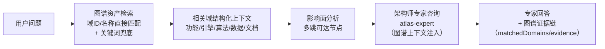

# 项目全息图谱（Project Atlas）

> 整个项目机器图谱化的唯一权威文档 · AINA-STD-001 §10
> 实现：`platform/backend-node/src/project-atlas/` · API：`/atlas/*`
> 验证：`GET /atlas/verify`（145 项无破窗检查）· `node test/test-project-atlas.js`

---

## 1. 核心命题：整个项目图谱化、归一化、关联本地代码

以本项目为基础，**所有功能自研**（零框架依赖，可借鉴业界架构思想），
把项目的全部核心内容——业务域、模块、引擎、算法、数据资产、文档——
节点化到一张图上，**机器图谱关联本地代码路径**，归一化承载，不出现破窗（无遗漏）。

- **130+ 节点**：25 业务域 + 4 模块 + 19 引擎 + 15 算法 + 34 数据资产 + 34 文档
- **180+ 关联边**：uses_engine / implements_algo / persists_to / documented_by + 引擎宇宙 42 条引擎间边
- **全域单一连通分量**：任何业务域 → 引擎 → 算法 → 数据 → 文档全链路可达

## 2. 六类节点 · 归一化承载

| 节点类型 | 数量 | 内容 | 本地代码关联 |
|---------|------|------|-------------|
| domain | 25 | 业务域（每个大模块 = 一个小项目） | codePath → src/routes/&lt;domain&gt;.js |
| module | 4 | 可插拔模块（graph/task/storage/melody2score） | codePath → src/modules/&lt;mod&gt;.js |
| engine | 19 | 引擎（复用引擎宇宙注册表，同一真相源） | codePath → 引擎实现文件 |
| algorithm | 15 | 自研算法（singleSource 单源标注） | codePath → 算法实现（含 Python 子项目） |
| data | 34 | 数据资产（data/ 目录全覆盖） | data/&lt;file&gt;.json |
| doc | 34 | 核心文档（docs/ 全域覆盖） | docs/**.md |

## 3. 无破窗验证（W1-W8，145 项机器检查）

每次调用 `GET /atlas/verify` **动态比对真实代码库**（不是静态断言）：

| 门禁 | 检查内容 | 防护的破窗 |
|------|---------|-----------|
| W1 路由域全覆盖 | 动态 require routes/index.js DOMAINS 表 vs 注册表 | 新增业务域忘登记图谱 |
| W2 数据资产全覆盖 | 动态扫描 data/ 目录 vs 注册表 | 新数据文件漏关联域 |
| W3 代码路径存在 | 每个域/模块/算法的 codePath 真实存在 | 注册表声明幽灵代码 |
| W4 文档存在 | 每个声明的文档真实存在 | 文档被删/改名未同步 |
| W5 引用完整性 | uses_engine 边指向真实引擎节点 | 引擎改名未同步 |
| W6 域功能内聚 | 每域 ≥3 关键功能 + ≥1 引擎 + 有文档 | 空壳域/无文档域 |
| W7 算法单源 | 全部算法 singleSource=true | 重复实现（复制粘贴算法） |
| W8 图谱连通 | 全域单一连通分量（无孤岛） | 子图脱钩（域→引擎→算法断链） |

**新增任何东西的三步 SOP**（破窗自动防护）：
1. 建代码文件（路由/模块/引擎/算法/数据/文档）
2. 在对应注册表登记一行（business-registry / tech-registry）
3. 跑 `GET /atlas/verify` —— 漏登记立即 FAIL，指名道姓

## 4. API 一览

| 端点 | 功能 |
|------|------|
| `GET /atlas` | 完整全息图谱（130+ 节点 + 180+ 边 + 分类型统计） |
| `GET /atlas/verify` | 无破窗验证（145 项动态检查） |
| `GET /atlas/domains/:id` | 单域全景：功能/引擎/算法/数据/文档一屏尽览 |
| `GET /atlas/impact/:id` | 影响面分析：改动一个节点波及哪些资产 |
| `GET /atlas/search?q=` | 图谱资产检索（关键词匹配全部节点属性） |
| `POST /atlas/consult` | **AI 图谱对话**：架构师专家 + 图谱上下文增强 |

## 5. AI 图谱对话（专家联盟集成）

`POST /atlas/consult` 的处理流程：



新增种子专家 **atlas-expert（项目总架构师）**：以全息图谱为知识源，
回答任何项目架构问题时基于机器检索的真实图谱数据，
引用具体域 ID、引擎 ID 与代码路径（可溯源、无幻觉）。

## 6. 架构（AINA 域包模式）

```
src/project-atlas/
  domain/
    business-registry.js   ← 25 业务域 + 4 模块注册表（静态值对象）
    tech-registry.js       ← 15 算法 + 34 数据资产 + 34 文档注册表
    atlas-graph.js         ← 图构建（6 类节点 8 类边）+ 影响面 + 连通分量（纯算法）
  index.js                 ← 门面：查询 API + 无破窗验证（W1-W8）
```

依赖方向：project-atlas → engine-universe（共享引擎注册表真相源）→ routes（动态比对）。

## 7. 落地记录

| 日期 | 事件 | 验证 |
|------|------|------|
| 2026-08-22 | 项目全息图谱域包落地：25 域 + 4 模块 + 19 引擎 + 15 算法 + 34 数据 + 34 文档图谱化；AI 架构师专家 + consultAtlas 图谱增强对话；atlas 路由域接入 | 无破窗验证 145/145；门禁 G1-G5 全绿；图谱测试全过；服务重启后全端点 200 |
