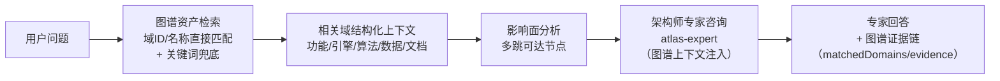
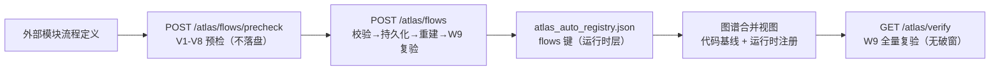
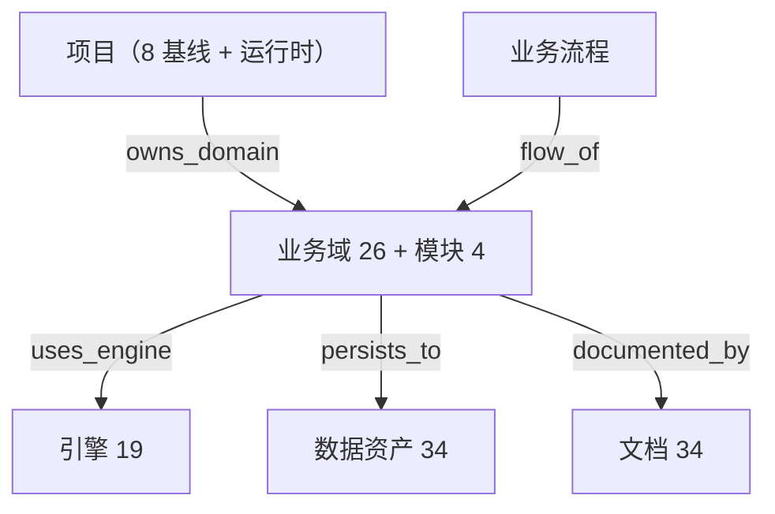

# 项目全息图谱（Project Atlas）

> 整个项目机器图谱化的唯一权威文档 · AINA-STD-001 §10
> 实现：`platform/backend-node/src/project-atlas/` · API：`/atlas/*`
> 验证：`GET /atlas/verify`（W1-W10 无破窗检查）· `node test/test-project-atlas.js`

---

## 1. 核心命题：整个项目图谱化、归一化、关联本地代码

以本项目为基础，**所有功能自研**（零框架依赖，可借鉴业界架构思想），
把项目的全部核心内容——业务域、模块、引擎、算法、数据资产、文档——
节点化到一张图上，**机器图谱关联本地代码路径**，归一化承载，不出现破窗（无遗漏）。

- **230+ 节点**：25 业务域 + 4 模块 + 19 引擎 + 15 算法 + 34 数据资产 + 34 文档 + 8 项目 + 流程步骤
- **410+ 关联边**：uses_engine / implements_algo / persists_to / documented_by / owns_domain + 引擎宇宙 42 条引擎间边
- **项目实体层（"一切皆是项目"）**：8 基线项目承载全部 30 治理单元（26 域 + 4 模块），含生命周期与健康度量
- **业务流程图谱化**：基线流程（flow-registry）+ 运行时注册流程（EAF-STD-001 接入）统一承载
- **全域单一连通分量**：项目 → 业务域 → 引擎 → 算法 → 数据 → 文档全链路可达

## 2. 六类节点 · 归一化承载

| 节点类型 | 数量 | 内容 | 本地代码关联 |
|---------|------|------|-------------|
| domain | 25 | 业务域（每个大模块 = 一个小项目） | codePath → src/routes/&lt;domain&gt;.js |
| module | 4 | 可插拔模块（graph/task/storage/melody2score） | codePath → src/modules/&lt;mod&gt;.js |
| engine | 19 | 引擎（复用引擎宇宙注册表，同一真相源） | codePath → 引擎实现文件 |
| algorithm | 15 | 自研算法（singleSource 单源标注） | codePath → 算法实现（含 Python 子项目） |
| data | 34 | 数据资产（data/ 目录全覆盖） | data/&lt;file&gt;.json |
| doc | 34 | 核心文档（docs/ 全域覆盖） | docs/**.md |

## 3. 无破窗验证（W1-W10，机器检查）

每次调用 `GET /atlas/verify` **动态比对真实代码库**（不是静态断言）：

| 门禁 | 检查内容 | 防护的破窗 |
|------|---------|-----------|
| W1 路由域全覆盖 | 动态 require routes/index.js DOMAINS 表 vs 注册表 | 新增业务域忘登记图谱 |
| W2 数据资产全覆盖 | 动态扫描 data/ 目录 vs 注册表 | 新数据文件漏关联域 |
| W3 代码路径存在 | 每个域/模块/算法的 codePath 真实存在 | 注册表声明幽灵代码 |
| W4 文档存在 | 每个声明的文档真实存在 | 文档被删/改名未同步 |
| W5 引用完整性 | uses_engine 边指向真实引擎节点 | 引擎改名未同步 |
| W6 域功能内聚 | 每域 ≥3 关键功能 + ≥1 引擎 + 有文档 | 空壳域/无文档域 |
| W7 算法单源 | 全部算法 singleSource=true | 重复实现（复制粘贴算法） |
| W8 图谱连通 | 全域单一连通分量（无孤岛） | 子图脱钩（域→引擎→算法断链） |
| W9 业务流程图谱化 | 流程 id 全局唯一/归属域存在/步骤结构/迁移边引用/委托引擎/数据依赖/连通可达/核心域覆盖/标准锚点（含运行时注册层） | 幽灵流程/断链流程/漏登记核心域流程 |
| W10 项目治理 | 项目 id 唯一/建模合法（P1-P6）/全部域与模块归属项目（无孤儿）/域归属唯一（无重复）/auto 域亦归属 | 幽灵项目/孤儿资产/重复归属/单域项目 |

**新增任何东西的三步 SOP**（破窗自动防护）：
1. 建代码文件（路由/模块/引擎/算法/数据/文档）
2. 在对应注册表登记一行（business-registry / tech-registry）
3. 跑 `GET /atlas/verify` —— 漏登记立即 FAIL，指名道姓

## 4. API 一览

| 端点 | 功能 |
|------|------|
| `GET /atlas` | 完整全息图谱（130+ 节点 + 180+ 边 + 分类型统计） |
| `GET /atlas/verify` | 无破窗验证（W1-W9 动态检查） |
| `GET /atlas/domains/:id` | 单域全景：功能/引擎/算法/数据/文档一屏尽览 |
| `GET /atlas/impact/:id` | 影响面分析：改动一个节点波及哪些资产 |
| `GET /atlas/search?q=` | 图谱资产检索（关键词匹配全部节点属性） |
| `POST /atlas/consult` | **AI 图谱对话**：架构师专家 + 图谱上下文增强 |
| `GET /atlas/flows` | 全系统流程清单（步骤数/降级数/关联域/标准锚点） |
| `GET /atlas/flows/:id` | 单流程全景（步骤链/委托引擎/数据读写/降级链） |
| `POST /atlas/flows/precheck` | **流程预检**：EAF-STD-001 V1-V8 校验，不落盘 |
| `POST /atlas/flows` | **流程注册**：校验→持久化→图谱重建→W9 复验 |
| `DELETE /atlas/flows/:id` | **流程移除**：仅运行时注册流程可移除（代码基线不可） |
| `GET /atlas/projects` | **项目清单**：8 基线项目 + 运行时项目，含健康度量与状态分布 |
| `GET /atlas/projects/:id` | **项目全景**：归属域展开（功能/引擎/数据/文档）+ 流程 + 健康分 |
| `GET /atlas/projects-lifecycle` | **生命周期状态机自描述**（5 状态 5 合法流转边） |
| `POST /atlas/projects/precheck` | **项目预检**：P1-P6 建模不变式校验，不落盘 |
| `POST /atlas/projects` | **项目创建**：校验→持久化→图谱重建→W10 复验 |
| `POST /atlas/projects/:id/transition` | **生命周期流转**：状态机合法边校验（不可逆，基线不可变更） |
| `POST /atlas/projects/:id/domains` | **域归属移交**：运行时项目间域移交（保持 P2 唯一归属） |
| `DELETE /atlas/projects/:id` | **项目移除**：仅运行时可移除；孤儿域防护；`reassignTo` 级联移交 |

## 5. AI 图谱对话（专家联盟集成）

`POST /atlas/consult` 的处理流程：



新增种子专家 **atlas-expert（项目总架构师）**：以全息图谱为知识源，
回答任何项目架构问题时基于机器检索的真实图谱数据，
引用具体域 ID、引擎 ID 与代码路径（可溯源、无幻觉）。

## 6. 通用流程注册（EAF-STD-001 接入）

任何模块可按 **EAF-STD-001 行业规范**向图谱动态注册业务流程，
成为通用 AI 知识图谱的流程基础设施：



**双层流程真相源**：

| 层 | 载体 | 可变性 |
|---|---|---|
| 代码基线 | `domain/flow-registry.js` | 不可变（随代码发布） |
| 运行时注册 | `data/atlas_auto_registry.json` flows 键 | 可注册/可移除（`runtime: true` 标记） |

**注册语义**：同 id 默认拒绝（幂等保护）；`overwrite: true` 覆盖更新。
**移除语义**：仅运行时注册流程可移除，代码基线流程返回 404（保护基线）。
**注册后契约**：注册即触发 W9 全量复验，注册不得引入破窗。

## 7. 项目实体层（"一切皆是项目"）

项目 = 聚合业务域的**顶层治理单元**。每个项目是一个独立小项目，
经 `owns_domain` 边持有业务域，从而聚合该域全部引擎/算法/数据/文档/流程资产。



**基线项目划分**（30 治理单元全归属，无孤儿）：

| 项目 | 状态 | 域 |
|---|---|---|
| proj-xuanji-core 璇玑核心平台 | maintaining | system/services/security/modules-admin/mod-storage |
| proj-knowledge 知识图谱与知识库 | maintaining | graph/mod-graph/kb |
| proj-ai-dialogue AI 对话协作 | delivered | chat/web-search/orchestration |
| proj-expert-alliance 专家联盟 | maintaining | expert-alliance/expert-graph |
| proj-ai-engine AI 引擎编排 | maintaining | ai-engine/ai-integrated/ai-ultimate/ai-enhanced/integration |
| proj-ai-platform AI 平台生态 | delivered | ai-platform/browser-market/tasks/auto-tasks/mod-task |
| proj-auto-dev 自动开发引擎 | building | auto-dev/artifacts/optimizer/mod-melody2score |
| proj-graph-infra 图谱基础设施 | building | atlas/engine-universe/engine-kernel |

**生命周期状态机**（单向不可逆）：
`planning → building → delivered → maintaining → archived`

**治理不变式（P1-P6，W10 机器验证）**：
- P1 项目身份：id 格式（`proj-` 前缀）/ name 必填 / 全局唯一
- P2 域归属唯一：每个域恰好归属一个项目（无孤儿、无重复）
- P3 引用真实：项目声明的域必须存在于图谱
- P4 状态合法：status ∈ 状态机合法集
- P5 流转合法：生命周期只能沿状态机合法边正向流转
- P6 项目内聚：每个项目 ≥2 个域（单域不成项目）

**健康度量**（0-100 分）：资产覆盖 60 分（域/引擎/数据/文档/流程）+ 验证全绿 40 分。

**双层项目真相源**：代码基线（project-registry.js，不可变）+ 运行时注册层
（atlas_auto_registry.json projects 键）。运行时项目可创建/流转/移交/级联移除，
每次变更即触发 W10 复验（变更不得引入破窗）。

## 8. 架构（AINA 域包模式）

```
src/project-atlas/
  domain/
    business-registry.js   ← 25 业务域 + 4 模块注册表（静态值对象）
    tech-registry.js       ← 15 算法 + 34 数据资产 + 34 文档注册表
    flow-registry.js       ← 代码基线业务流程注册表（EAF-STD-001 建模）
    flow-validator.js      ← EAF-STD-001 建模不变式校验 V1-V8（纯函数零 IO）
    project-registry.js    ← 8 基线项目 + 生命周期状态机 + P1-P6 校验 + 健康度量（纯函数）
    atlas-graph.js         ← 图构建（8 类节点 13 类边）+ 影响面 + 连通分量（纯算法）
  application/
    self-sync-service.js   ← 图谱自管理用例（扫描→差量→登记→重建→复验）
    flow-registration-service.js ← 通用流程注册用例（校验→持久化→重建→W9 复验）
    project-service.js     ← 项目治理用例（创建/流转/移交/级联移除/健康度量）
  infrastructure/
    atlas-scanner.js       ← 代码库扫描器（真实文件系统 IO）
  index.js                 ← 门面：查询 API + 无破窗验证（W1-W10）+ 服务装配
```

依赖方向：project-atlas → engine-universe（共享引擎注册表真相源）→ routes（动态比对）。

## 9. 落地记录

| 日期 | 事件 | 验证 |
|------|------|------|
| 2026-08-22 | 项目全息图谱域包落地：25 域 + 4 模块 + 19 引擎 + 15 算法 + 34 数据 + 34 文档图谱化；AI 架构师专家 + consultAtlas 图谱增强对话；atlas 路由域接入 | 无破窗验证全绿；门禁 G1-G5 全绿；图谱测试全过；服务重启后全端点 200 |
| 2026-08-22 | W9 业务流程图谱化落地：flow-registry 基线 + flow-validator（V1-V8）+ flow-registration-service；POST/DELETE /atlas/flows + precheck 端点；self-sync 保留 flows 键 | 合法注册/非法拒绝/幂等覆盖/删除/持久化/重启恢复测试全过；W9 含运行时注册层全绿 |
| 2026-08-22 | W10 项目治理落地（"一切皆是项目"）：project-registry（8 基线项目 + 生命周期状态机 + P1-P6）+ project-service（创建/流转/移交/级联移除/健康度量）+ /atlas/projects 端点族；W1 ghost 检查豁免 auto 域 | 项目治理测试 58 项全过（含外部篡改守门验证）；HTTP E2E 13 项全过；W10 12 项全绿；266 项无破窗 |
