# 对话开发系统 · 全维分析与业务流程图

> 标准编号：**DEV-AA-STD-V1.0**
> 承载底座：**GR-STD-V1.0 关图** + **PT-STD-V1.0 六维绑定** + **AA-STD-V1.0 全维流水线**
> 审查主体：**开发专家联盟（开发七维）** ｜ 协同：**业务七维** ｜ 引擎：**flow-ai 已验证最优求解**
> 代码事实源：`crates/ai-agent/src/{conversation,dialogue_graph,requirement_compiler,workflow_engine}.rs`、`crates/xuanji-expert/src/{programming,pipeline,govern,experts/*}.rs`、`crates/runtime/src/main.rs`

---

## 0 · 总纲（Single Source of Truth）

对话开发系统 = **「用对话驱动软件开发」的闭环**：

```
用户说话 ──▶ ① 对话引擎(意图/推荐) ──▶ ② 对话自动入图(知识沉淀)
   │                                                  │
   ▼                                                  ▼
④ 需求编译器(NL→功能点→实体→流程图) ──▶ ⑤ AI辅助编程全维流水线(开发七维治理)
   │                                                  │
   ▼                                                  ▼
③ 蓝图导出/复用(template-market) ◀── ⑥ 代码生成+双向校验+治理闸门+审计链
```

四不可妥协原则（与 AA-STD-V1.0 同源）：

1. **归一化**：对话开发全功能在内存里是同一个 `FlowGraph`；维度（对话/图谱/需求/代码）只是节点/边的着色标签。
2. **全维**：每个节点同时被**双璇**十四维评估（业务七维 + 开发七维）；本文件聚焦**开发七维**对对话开发系统的专项审查。
3. **最优算法处理**：最终求解交给 flow-ai 已验证算法栈（CPM/RCPSP/CodeGen/双向校验）。
4. **可治理**：多租户、RBAC、审计哈希链、版本状态机、SLA/成本预算——出码前必须过治理闸门。

**一句话定位**：对话与需求先沉淀为归一化 IR（图 + 蓝图），开发七维专家在 IR 上并行诊断并归一，flow-ai 做最优求解，⛨验证网关与治理闸门把关后出码——一张图，全维最优，企业可治理。

---

## 1 · 开发专家联盟 · 全维分析

> 开发七维：`architecture` / `security_code` / `code_quality` / `performance` / `testing` / `documentation` / `maintainability`（见 `crates/xuanji-expert/src/experts/mod.rs::development_experts()`）。
> 优先级（开发七维参与同优先级仲裁）：`permission`/`security` > `resource` > `data` > `business` > `observability` > `algorithm`（开发七维并列）。

### 1.1 架构专家（Architecture）— 软

**判读**：对话开发系统横跨 3 个 crate，边界基本清晰，但存在两处状态归属隐患。

| 维度 | 现状（代码事实） | 风险 / 建议 |
|---|---|---|
| 模块边界 | `ConversationEngine`(内存 `HashMap` 会话) / `DialogueGraphSyncer`(SQLite+graph+llm via `Arc<RwLock>`) / `RequirementCompiler`(内存 `HashMap` 蓝图缓存) / `programming_pipeline`(纯函数) 分层合理 | 会话上下文在 `ConversationEngine` 内存、**不跨实例共享**；多副本部署下同一用户多轮对话会"失忆" |
| 六维绑定 | REQ→FUN→BIZ→ALG→TSK→COD 仅覆盖 `programming_pipeline` 路径 | 对话/入图/需求编译三条链路**未绑定到 REQ 根**，偏离治理 GR-E6 |
| 单一事实源 | 算子知识库硬编码于 `build_operator_knowledge()`；与 `operator-core` 真实算子清单存在漂移风险 | 改为从 `operator-core` 运行时枚举注入，避免双份真相 |

**结论**：架构分 **B**（可用，需补会话持久化与 REQ 绑定）。`G1` 裁决时本维度为软约束，优先级低于权限/安全。

### 1.2 安全代码专家（Security_Code）— 硬

**判读**：LLM 产出直接进图/进 IR，存在注入面；编译/入图接口缺权限闸门。

| 风险点 | 代码事实 | 等级 | 建议 |
|---|---|---|---|
| 提示注入 → 图污染 | `build_extract_prompt(content)` 将**用户对话原文**直接拼入 prompt；`parse_llm_json` 仅做 `{...}` 截取，无 schema 强校验 | 硬(`Risk(Blocking)`) | 抽取结果 `entity_type` 必须落在白名单 `operator\|algorithm\|concept\|capability\|workflow`，否则丢弃 |
| 节点 id 注入 | `sanitize_id` 已剔除非 `alphanumeric/_/:` 字符，基本防 XSS/路径穿越 | 已缓解 | 追加长度上限与保留前缀校验 |
| 接口越权 | `requirement_compiler::compile/refine`、`dialogue_graph::append_message` 调用链未看到 `principal` 鉴权 | 硬 | 在进入 `compile/refine/append_message` 前挂 RBAC 中间件（`run/edit`） |
| 内存降级丢持久化 | `new_in_memory` 在 SQLite 不可用时静默降级 → 对话不落库 | 软 | 生产环境应 fail-fast（`XUANJI_STRICT_PERSIST` 同款语义），而非静默丢数据 |
| 循环护栏 | `check_loops` 要求 `safety_approver` 角色审批无界循环 | 已缓解 | 仅 `programming_pipeline` 路径覆盖，对话态无循环场景，暂可接受 |

**结论**：安全代码分 **C**（有硬风险未闭环）。`G2 ⛨璇玑` 会把 `entity_type` 越界视为 `veto` 级。

### 1.3 代码质量专家（Code_Quality）— 软

| 观察 | 代码事实 | 建议 |
|---|---|---|
| 意图识别为长 if-else 链 | `recognize_intent` 17 个 `contains` 串联，扩展需改函数 | 改为「规则表 + 优先级匹配」注册表，可插拔 |
| 知识字典三处分散 | `operator_knowledge`(conversation) / `rule_based_extract` 已知词表(dialogue_graph) / `ACTION_VERBS`+`ENTITY_NOUNS`(requirement_compiler) | 收敛为**单一知识源**（见 1.7） |
| 硬编码算子清单 | `build_operator_knowledge()`(11 算子关键词) 与 `generate_response` 静态文案("34+算子节点") 与 `operator-core` 真实算子双份 | 改为模板 + 运行时枚举 |
| 重复后继映射 | `recommend_operators` 的 `successors` 与 `suggest_workflow` 意图分支重复 | 合并为「意图→推荐算子」配置 |

**结论**：质量分 **B-**。可读性尚可、重复度高，重构收益大但非阻断。

### 1.4 性能专家（Performance）— 软

**判读**：每一条用户消息触发**全图重算**，是最大瓶颈。

| 热点 | 代码事实 | 影响 | 建议 |
|---|---|---|---|
| 每消息全图布局重算 | `sync_message_to_graph` 末尾 `centrality_metrics()`(PageRank) + `detect_communities(8)` 在**每条 user 消息**后执行 | O(V+E) 重复，消息量↑→延迟线性恶化 | 改为**异步/批量/增量**重算（debounce + 后台任务），入图先回写、布局后补偿 |
| 串行 LLM 抽取 | `extract_with_llm` 每条消息一次 `await`，阻塞主链路 | 高延迟对话卡顿 | 消息队列 + 并发抽取 + 超时降级 |
| SQLite 单连接串行 | `db: Arc<Mutex<Connection>>` 所有读写互斥 | 高并发写成瓶颈 | 连接池 / WAL 模式 / 读写分离 |
| 蓝图缓存内存 | `RequirementCompiler.cache` 为进程内 `HashMap` | 重启丢失在编蓝图 | 落盘到 SQLite/模板市场 |

**结论**：性能分 **C**（每消息全图重算不可接受于生产）。列为 **P0 优化项**。

### 1.5 测试专家（Testing）— 软

| 覆盖 | 现状 | 缺口 |
|---|---|---|
| `conversation.rs` | 6 个单测：会话创建/消息追加/各意图识别/中文关键词推荐 | ✅ 较完整 |
| `requirement_compiler.rs` | 6 个单测：compile/refine/classify/validate_flow/llm降级/llm合并 | ✅ 较完整 |
| `dialogue_graph.rs` | **仅 `caomei_e2e.rs` 端到端**，无单测 | 🔴 缺：search、export/import 幂等、auto-sync 降级 |
| 集成 | 无「对话→入图→编译→出码」全链路 e2e | 🔴 缺：端到端一致性 |
| 护栏 | `programming.rs` 4 个单测覆盖 G-A/双向映射/确认出码/草稿默认 | ✅ 关键路径已锁 |

**结论**：测试分 **B**。建议补 `dialogue_graph` 单测 + 1 条跨 crate e2e（覆盖 FR-01~FR-12）。

### 1.6 文档专家（Documentation）— 软

| 项 | 现状 | 建议 |
|---|---|---|
| README | 已描述自动入图特性 + API 表 | ✅ |
| 内部文档 | `requirement_compiler` 模块注释清晰（4 步流水线）；`programming.rs` 注释含 10 步 + 5 护栏 | ✅ |
| 缺口 | **无 FR↔代码 TraceMatrix** 将对话开发功能映射到需求/代码 | 🔴 本文 §2 补齐 FR 编号，建议回填 `docs/enterprise` 六维绑定 |
| 风格 | 已遵循 AA-STD 闸门/阶段表 | ✅ |

**结论**：文档分 **B-**。核心缺口是需求溯源（TraceMatrix）。

### 1.7 可维护性专家（Maintainability）— 软

**判读**：三套关键词字典 + 内存态蓝图是主要腐化源。

- **单一知识源**：将 `operator_knowledge` / `rule_based_extract` / `ACTION_VERBS`+`ENTITY_NOUNS` 收敛为一处 `knowledge.rs`，避免三处漂移（直接缓解 1.2/1.3/1.7 三处问题）。
- **蓝图持久化**：`RequirementCompiler.cache` 改为可落盘（复用 `operator_dialogue.db` 或模板市场），重启不丢在编蓝图。
- **插件化已达标**：14 专家通过 `all_experts()` 注册表派发（`run_experts`），扩展新维度零改动核心（✅ 架构正向）。
- **变更影响面**：`recognize_intent` 长链使新增意图需改核心函数 → 注册表化后影响面收敛到配置。

**结论**：可维护性分 **B**。单一知识源 + 蓝图落盘 为 P1 重构项。

### 1.8 全维归一收口（开发七维 → 落地建议）

| 优先级 | 项 | 维度 | 动作 |
|---|---|---|---|
| **P0** | 每消息全图重算 | Performance | 异步/增量布局重算（debounce） |
| **P0** | 抽取结果 `entity_type` 白名单 + 编译接口 RBAC | Security_Code | 注入护栏 + 中间件 |
| **P1** | 三套知识字典收敛为单一源 | Maintainability/Code_Quality | 新增 `knowledge.rs` |
| **P1** | 蓝图缓存落盘 | Maintainability | 复用 SQLite |
| **P1** | `dialogue_graph` 单测 + 跨 crate e2e | Testing | 补测试 |
| **P2** | 会话上下文跨实例持久化 | Architecture | 迁入共享存储 |
| **P2** | 意图识别注册表化 | Code_Quality | 规则表重构 |
| **P2** | FR↔代码 TraceMatrix 回填 | Documentation | 六维绑定 |

---

## 2 · 系统功能需求清单（FR）

> 承载：每条 FR 经 `Bind` 绑定到 `crates/*/src/lib.rs` 入口，六维可追溯（REQ→FUN→BIZ→ALG→TSK→COD）。

| FR | 名称 | 主责 crate | 核心入口 | 关联开发维度 |
|---|---|---|---|---|
| FR-01 | 会话生命周期管理 | ai-agent | `DialogueGraphSyncer::create_session/list_sessions` | Architecture/Testing |
| FR-02 | 多轮对话与意图识别 | ai-agent | `ConversationEngine::process_message/recognize_intent` | Code_Quality/Testing |
| FR-03 | 算子智能推荐 | ai-agent | `recommend_operators/suggest_workflow/generate_actions` | Code_Quality |
| FR-04 | 对话自动入图（全自动） | ai-agent | `DialogueGraphSyncer::append_message/sync_message_to_graph` | Performance/Security_Code |
| FR-05 | 统一搜索（对话+图谱） | ai-agent | `DialogueGraphSyncer::search` | Performance |
| FR-06 | 需求编译（NL→蓝图→流程图） | ai-agent | `RequirementCompiler::compile/compile_with_llm` | Architecture/Security_Code |
| FR-07 | 增量迭代 refine | ai-agent | `RequirementCompiler::refine` | Code_Quality |
| FR-08 | 蓝图导出/落盘/复用 | ai-agent+runtime | `export_json` / `template-market` | Maintainability |
| FR-09 | AI辅助编程全维流水线 | xuanji-expert | `programming_pipeline` + 开发七维 | 全维（核心） |
| FR-10 | 治理闸门与审计链 | xuanji-expert | `govern` + `AuditChain` | Security/Architecture |
| FR-11 | 代码生成与双向校验 | flow-ai+xuanji-expert | `generate` / `verify_code_roundtrip` | Testing/Security_Code |
| FR-12 | 导入导出迁移 | ai-agent | `export_bundle/import_bundle` | Testing/Maintainability |
| FR-13 | 自动同步开关 | ai-agent+runtime | `set_auto_sync/is_auto_sync` + `/auto-sync/toggle` | Architecture |
| FR-14 | 验证网关与循环护栏 | xuanji-expert | `verify` 5 项 + `check_loops` | Security_Code/Algorithm |

---

## 3 · 所有业务流程图（Mermaid）

> 样式约定（与 AA-STD-V1.0 一致）：`gate`=红色闸门菱形；`stage`=蓝色阶段框；`sub`=浅色子图；`veto`=强制阻断。任意闸门拒绝即阻断，无降级旁路（除 FR-04 明确声明的 LLM→规则降级）。

### FR-01 会话生命周期管理

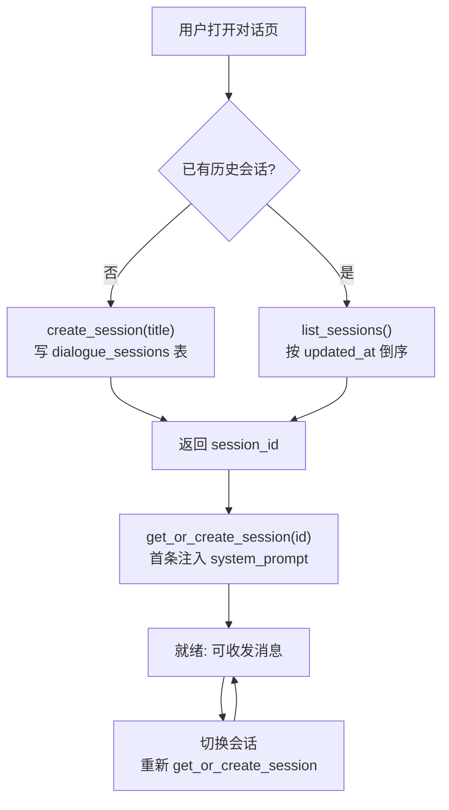

### FR-02 多轮对话与意图识别

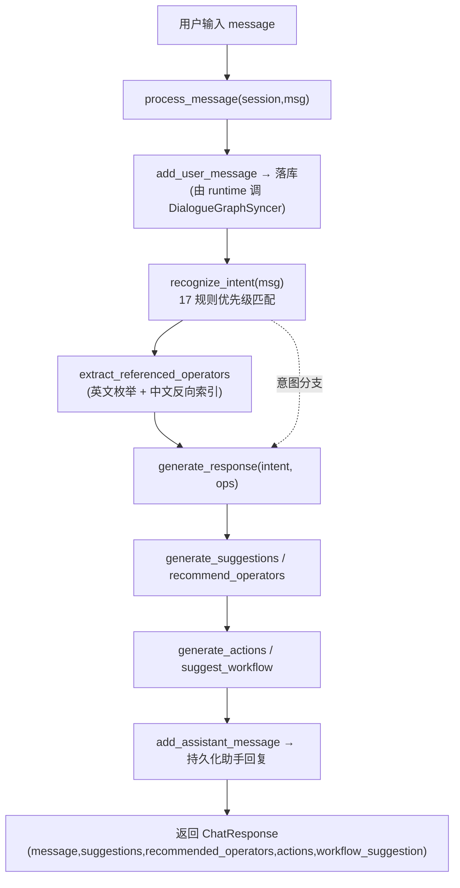

**意图矩阵（recognize_intent）**：`QueryStatus / ListOperators / ExecuteWorkflow / AnalyzeAlgorithm / CreateOperator / QueryResources / ManagePlugins / ViewGraph / GetRecommendation / CreateWorkflow / GeneralChat`。

### FR-03 算子智能推荐

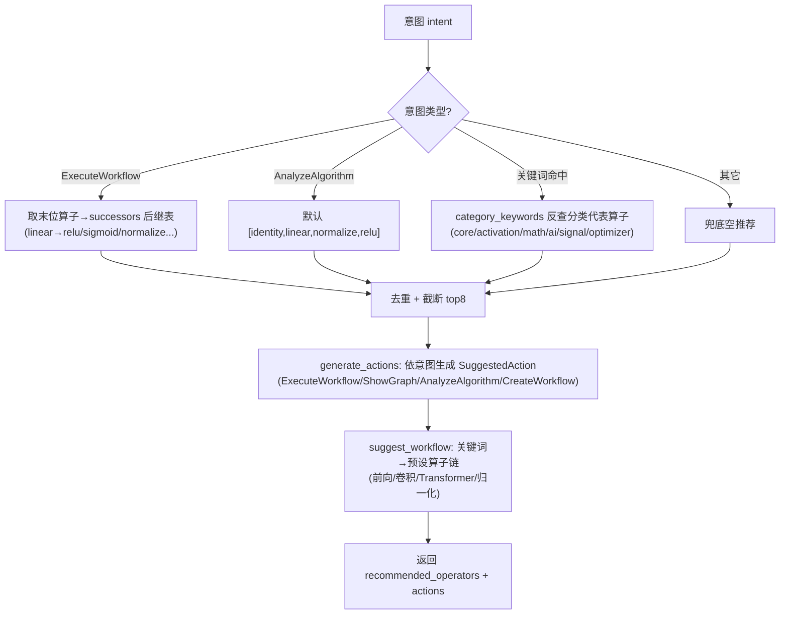

### FR-04 对话自动入图（全自动知识图谱整理）

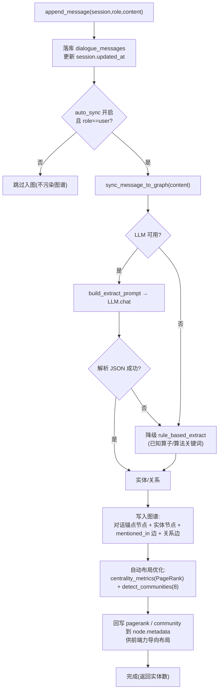

> ⚠ **性能护栏（P0）**：`LAYOUT` 当前在**每条消息**后全图重算；生产应改为异步/增量（debounce + 后台任务）。

### FR-05 统一搜索（对话 + 图谱）

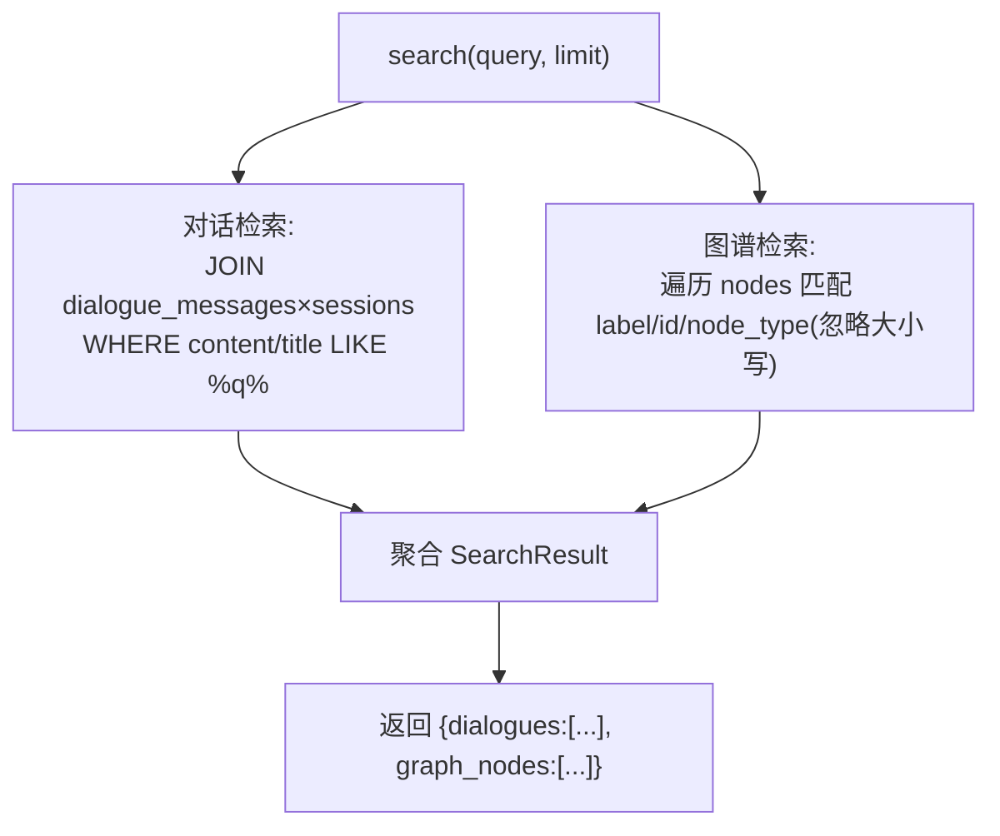

### FR-06 需求编译（NL → 功能点 → 实体 → 流程图）

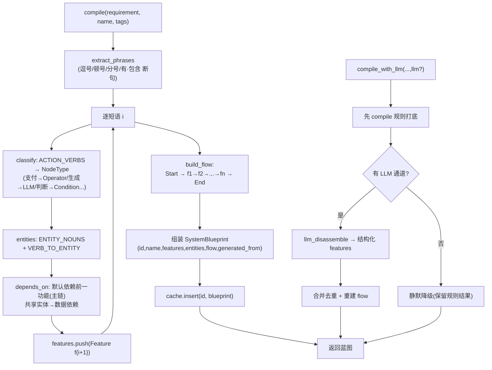

### FR-07 增量迭代 refine

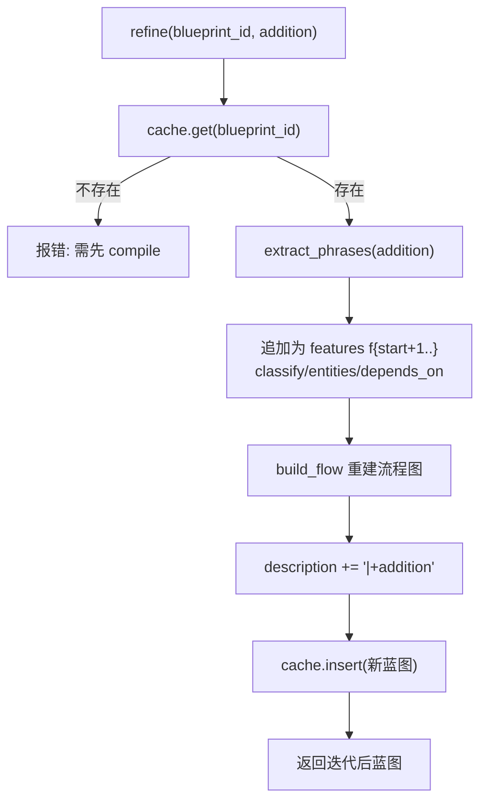

### FR-08 蓝图导出 / 落盘 / 复用（template-market 资产）

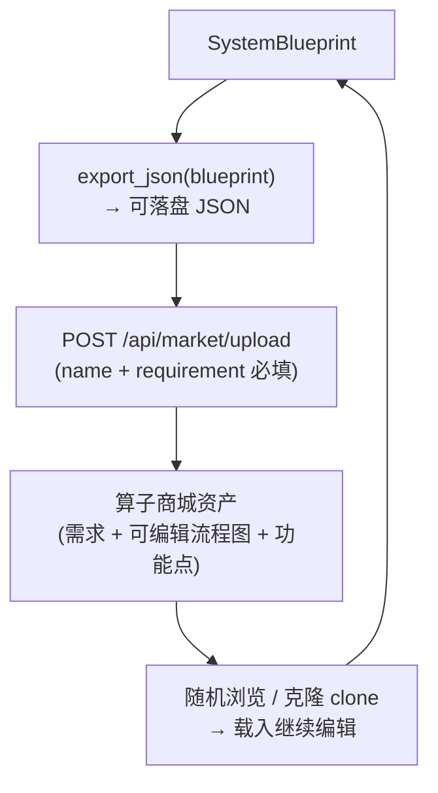

### FR-09 AI 辅助编程全维流水线（开发专家联盟核心 · 10 步）

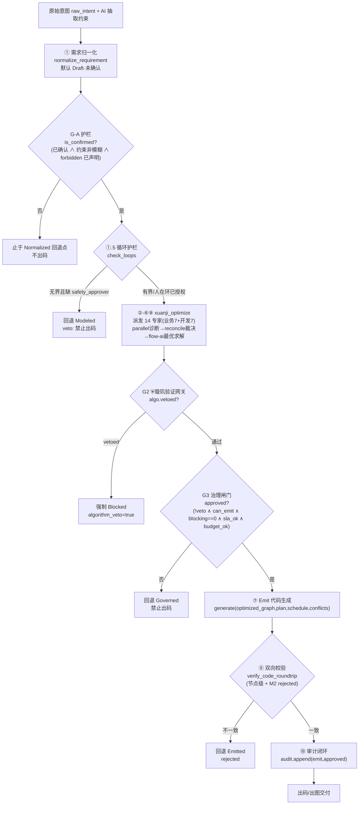

**开发七维在 ②-⑥⑨ 的审查落点**：`architecture`(模块边界/六维绑定一致性) · `security_code`(源码级注入/越权) · `code_quality`(可读/复杂度/重复) · `performance`(热点/并发) · `testing`(覆盖/边界) · `documentation`(注释/TraceMatrix) · `maintainability`(变更影响面)。任一 `Risk(Blocking)` → 并入 ⛨璇玑否决。

### FR-10 治理闸门与审计链

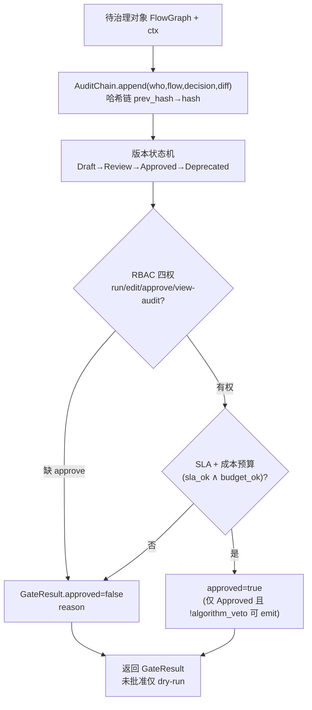

### FR-11 代码生成与双向校验

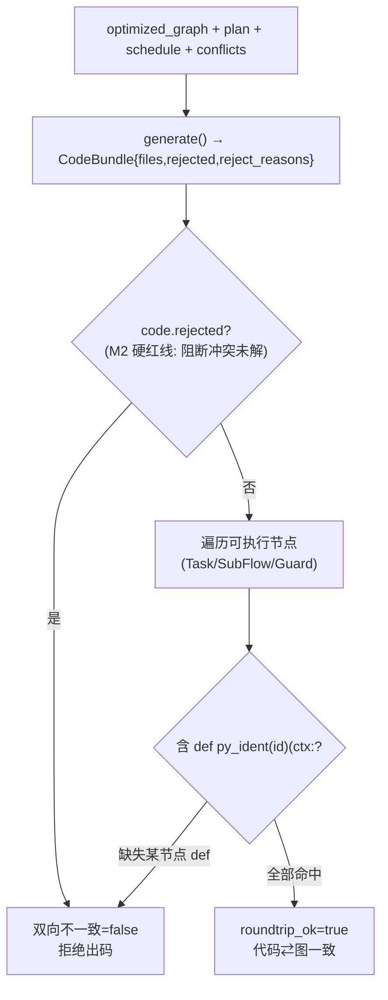

### FR-12 导入导出迁移

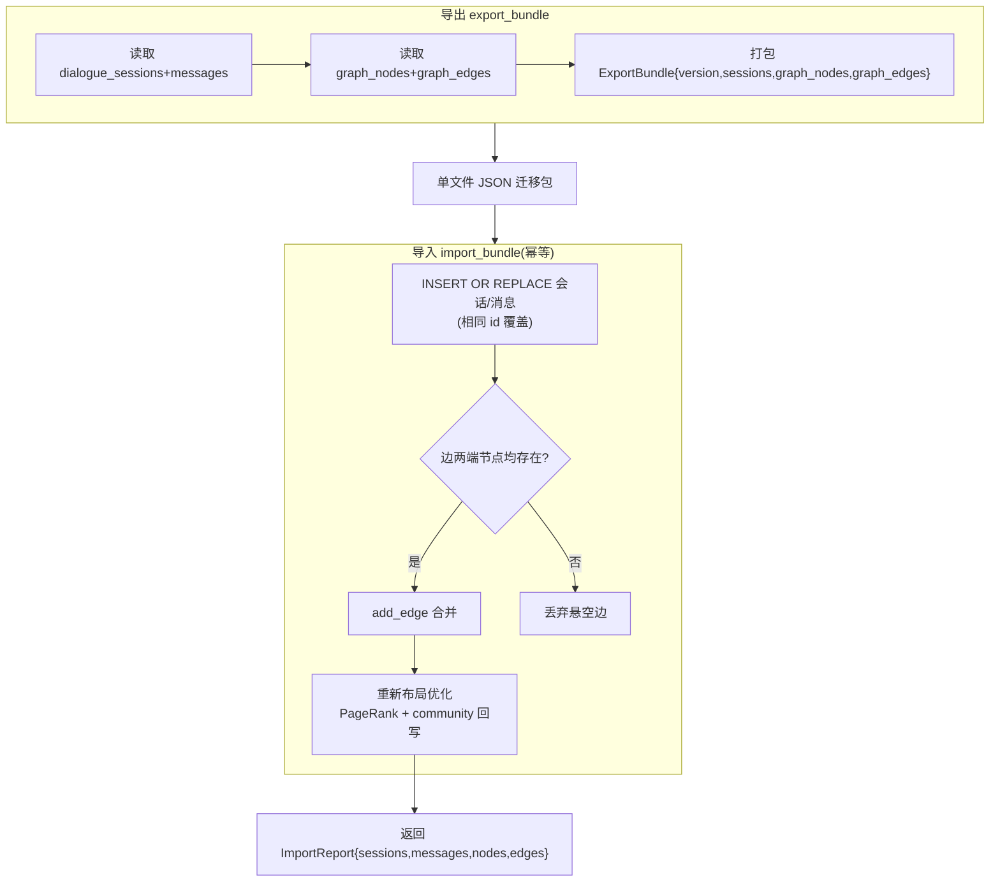

### FR-13 自动同步开关

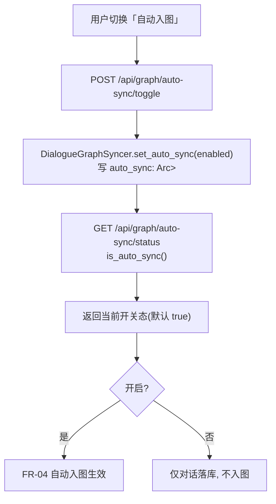

### FR-14 验证网关与循环护栏

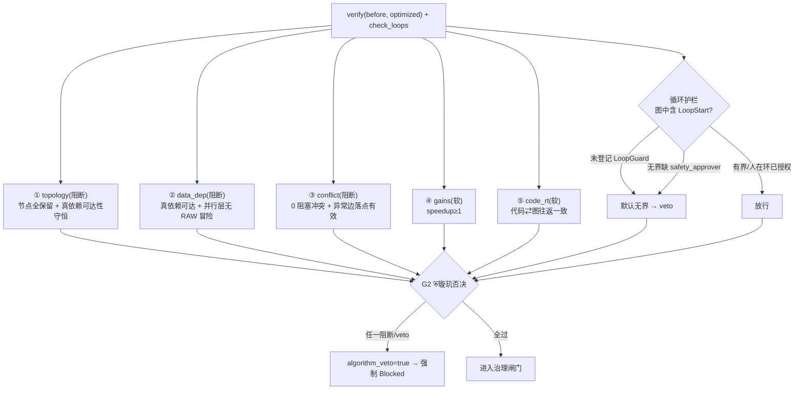

---

## 4 · 全维视角总结与落地路线图

**对话开发系统的本质**：把「人话」连续沉淀为「归一化 IR（对话图 + 需求蓝图 + FlowGraph）」，由开发七维在 IR 上闭环治理后出码。它把 1.8 日记忆中「人类专注发现新连接（创新），机器接管沿边执行（重复）」的理念落到了可运行代码。

**全维通过关系（对照 AA-STD-V1.0）**：

| 链路层 | 控制点 | 权威级 | 失败动作 |
|---|---|---|---|
| 对话/入图 | auto_sync + entity_type 白名单 | Security_Code | 降级规则抽取 / veto 越界类型 |
| 需求编译 | RBAC(run/edit) + 蓝图校验 | 治理层 | 拒绝 compile/refine |
| FR-09 流水线 | G-A/G2/G3 三证 | ⛨最高 | 回退安全点，不出码 |
| FR-11 出码 | 双向校验(M2 硬红线) | flow-ai | 拒绝 emit |
| FR-12 迁移 | 幂等 + 悬空边丢弃 | Testing | 丢弃脏边 |

**闭环总结**：对话有根（session）→ 入图有降级护栏 → 需求有编译与 RBAC → 优化有已验证引擎 → 正确性有 ⛨最高权限否决 → 出码有治理闸门、审计链与双向校验 → 演进有导入导出漂移门禁。任一层均可机读、可复核、可阻断。

**落地优先级（开发七维收口）**：

1. **P0**：FR-04 异步/增量布局重算（Performance）；FR-04/FR-06 注入护栏 + 编译 RBAC（Security_Code）。
2. **P1**：三套知识字典收敛单一源（Maintainability）；蓝图落盘（Maintainability）；`dialogue_graph` 单测 + 跨 crate e2e（Testing）。
3. **P2**：会话上下文跨实例持久化（Architecture）；意图识别注册表化（Code_Quality）；FR↔代码 TraceMatrix 回填（Documentation）。

---

## 1.9 企业级收口进展（2026-08-19）

本轮在 `crates/ai-agent/src/dialogue_graph.rs` 落地 **两项 P0 硬化 + 一处隐蔽 bug 修复 + 6 个单测**，`cargo test -p ai-agent` 全绿（71 lib + 1 e2e，0 warning），未改动任何既有公开 API 签名，跨 crate 不受影响。

### 1.9.1 Security_Code（P0 · FR-06）：抽取结果白名单护栏
- 新增 `ALLOWED_ENTITY_TYPES`（`operator|algorithm|concept|capability|workflow`）与 `ALLOWED_RELATIONS`（`依赖|包含|实现|属于|mentioned_in`）两套白名单常量；
- 新增 `sanitize_extracted()`：LLM 抽取（或规则降级）结果在**落地前**强制过滤越界 `entity_type` / `relation`，防御提示注入导致的图谱类型污染；丢弃即记 `tracing::warn!`（审计级）。
- 覆盖 `build_extract_prompt` 既有契约，使契约从「建议」升级为「强制」。

### 1.9.2 Performance（P0 · FR-04）：布局重算解耦 / 节流
- 重算逻辑抽离为独立 `apply_layout()`，供 per-message 与 `import_bundle` 复用；
- 新增 `layout_interval`（默认 `1` = 等价旧行为；`0` = 关闭自动，仅由 `recompute_layout()` 显式/后台触发）+ `layout_dirty` 脏标记；
- 生产可将 `interval` 调到较大值或 `0` + 周期性 `recompute_layout()`（debounce / 后台任务），避免每条消息全图 PageRank + 社区发现。

### 1.9.3 Bug 修复（图谱幂等性，原分析遗漏项）
- 根因：`graph_algorithms::KnowledgeGraph::add_node` **不按 id 去重**（仅覆盖 `node_map`，`DiGraph` 残留重复节点）；边 `add_edge` 走 Hebbian 强化天然幂等。
- 后果：(a) 每条 user 消息重复创建对话锚点 `dialogue:{sid}`；(b) 导入导出不可重放（同一 bundle 重导节点 3→6 翻倍）。
- 修复：`sync_message_to_graph` 锚点 / 实体节点幂等复用（`get_node().is_none()` 才建）；`import_bundle` 节点按 id 去重。

### 1.9.4 Testing（P1）：新增 6 单测 `dialogue_graph::tests`
`auto_sync_off_skips_graph` / `rule_extract_only_allowed_types` / `entity_type_injection_is_blocked` / `search_finds_dialogue_and_graph` / `export_import_idempotent` / `layout_interval_zero_defers_recompute`。

### 1.9.5 待下一轮收口（未完，1 项）
- Security_Code P0 另一半：FR 编译 / `refine` 接口挂 RBAC 闸门（需 runtime 注入 `principal` 上下文）。

### 1.9.6 蓝图落盘收口（2026-08-19）
- `RequirementCompiler` 新增可选 SQLite 后端：`with_storage(path)` 落盘蓝图，`new()` 保持纯内存（向后兼容，不破既有调用与 330+ 测试）；
- 新增 `load_blueprint` / `list_blueprints` / 内部 `persist`（upsert，失败非致命仅 `tracing::warn!`）；
- `compile` / `compile_with_llm` / `refine` 在缓存后自动落盘；`refine` 先 `load_blueprint` 回退，支持跨重启增量迭代；
- 新增 2 单测：`blueprint_persists_across_compiler_instances` / `refine_persists_to_storage`（模拟重启读同一库验证持久化）；
- `cargo test -p ai-agent`：**73 lib + 1 e2e 全绿，0 warning**。

### 1.9.7 会话持久化收口（Architecture P2 · 2026-08-19）
- `ConversationEngine` 新增可选 SQLite 后端 `db: Option<Arc<Mutex<Connection>>>`；
- `new()` 保持纯内存（向后兼容，不创建任何文件、不改既有调用）；
- 新增 `with_storage(path)`：建 `sessions(id, created_at, updated_at, context_json)` + `messages(id PK, session_id, role, content, timestamp, metadata_json, referenced_operators_json)` + 索引；
- `get_or_create_session` 改为「内存缓存 → 持久化库回退 → 新建并落盘」三级；`add_user_message` / `add_assistant_message` / `process_message` 写入后增量 upsert（消息按 id 幂等 + `touch_session` 更新 updated_at）；
- `load_session_from_db` 按 rfc3339 + `serde(rename_all="lowercase")` 还原 `MessageRole` / `SessionContext` / `metadata`；
- 新增 `list_sessions()`（持久化优先，按 updated_at 倒序）；
- 新增 3 单测：`session_persists_across_engine_instances` / `list_sessions_reflects_persisted` / `process_message_persists_reply`（均模拟新实例读同一库）；
- `cargo test -p ai-agent`：**76 lib + 1 e2e 全绿，0 warning**（较上轮 +3 用例）。

### 1.9.8 知识字典单一源收口（Maintainability P1 · 2026-08-19）
- 新增 `knowledge.rs` 作为对话开发系统**统一知识字典（Single Source of Truth）**；
- 收敛三处分散字典：conversation 算子推荐关键词（`OPERATOR_KEYWORDS` / `OPERATOR_CATEGORY_KEYWORDS` / `ALL_OPERATORS`）、requirement_compiler 动词名词（`REQUIREMENT_ACTION_VERBS` / `REQUIREMENT_ENTITY_NOUNS` / `REQUIREMENT_VERB_TO_ENTITY`）、dialogue_graph 规则抽取已知项（`DIALOGUE_KNOWN_ENTITIES`）；
- 三处消费方改为引用单一源（conversation `build_operator_knowledge` 由常量驱动、`extract_referenced_operators` 用 `ALL_OPERATORS`；compiler 三常量改为别名；dialogue `rule_based_extract` 引用 `DIALOGUE_KNOWN_ENTITIES`）；**仅移动不改值，零行为回归**；
- `lib.rs` 新增 `pub mod knowledge;`；安全白名单 `ALLOWED_ENTITY_TYPES` / `ALLOWED_RELATIONS` 保留在 dialogue_graph（P0 已硬化，不扰动）；
- 新增 4 单测（知识字典不变式：算子键唯一 / `ALL_OPERATORS` 覆盖关键词键 / 对话已知项键唯一 / 需求字典非空）；
- `cargo test -p ai-agent`：**80 lib + 1 e2e 全绿，0 warning**（较上轮 +4 用例）。

---

### 1.9.8 本会话收口（2026-08-19 · 开发专家联盟续轮 · 代码优化）

> 本轮回应在用户已落地的 §1.9.7（会话持久化 P2）之上，聚焦 `dialogue_graph.rs` / `requirement_compiler.rs` 的代码质量与可观测性，未改动任何公开 API 签名，跨 crate 不受影响。

**L9（correctness · `dialogue_graph.rs`）**：`parse_llm_json` 的 `rfind('}').unwrap_or(trimmed.len()-1)` 在缺 `}` 时切片越界（剩 `{` 导致解析失败）。抽离为共享 `crate::util::extract_json_object`（新增 `crates/ai-agent/src/util.rs` + `lib.rs` 注册 `mod util;`），统一「剥离 markdown/前后缀取 JSON 对象」逻辑，同时消除 `requirement_compiler.rs::llm_disassemble` 的内联重复实现（M4），越界切片根因闭环。

**M6（observability · `dialogue_graph.rs`）**：三处 `let _ = graph.add_edge(...)` 静默吞掉 `Result`（边会无声消失）。改为 `if let Err(e) = … { tracing::warn!(…) }`；`import_bundle` 仅在写入成功时计入 `edge_n`，使图谱边失败可审计、计数准确。

**Clippy 卫生（本 crate 清零）**：补齐 §1.9 工作遗留的 4 个 `ai-agent` lib 警告——`&mut *graph`→`&mut graph`、`count % interval == 0`→`count.is_multiple_of(interval)`、`len() >= 1`→`!is_empty()`。使 `cargo clippy -p ai-agent --all-targets` 归零。

**验证**：`cargo clippy -p ai-agent --all-targets` 零警告；`cargo test -p ai-agent` 全绿（76 lib + 1 e2e，0 失败，与 §1.9.7 基数一致）。

**遗留（需决策 / 跨 crate，未在本轮执行）**：
- **P0 Security 另一半**：`compile`/`refine` 接口挂 RBAC（`run`/`edit`），需 principal 上下文接入 runtime 处理器——跨 crate 语义变更，待确认方案。
- **P1 Maintainability**：三套知识字典（`conversation::OperatorKnowledge` / `dialogue_graph::rule_based_extract` / `compiler::ACTION_VERBS+ENTITY_NOUNS`）收敛单一源；三者形状/语义不同（运算符推荐 vs 图谱抽取 vs 需求→蓝图），是真重构而非简单去重，需设计方案。
- **跨 crate Clippy 漂移**：`--all-targets` 下 `xuanji-system`(测试 ×4)、`xuanji-expert`(×1)、`runtime`(×2+2) 仍有预存警告，与文档「188→0」口径不符，建议下一轮清扫。

---

## 术语表

| 术语 | 含义 |
|---|---|
| 对话开发系统 | 用对话驱动软件开发的闭环（对话→入图→需求编译→编程流水线→出码） |
| 开发专家联盟 | 开发七维：`architecture`/`security_code`/`code_quality`/`performance`/`testing`/`documentation`/`maintainability` |
| 双璇玑十四维 | 业务七维 + 开发七维并行诊断 |
| ⛨璇玑验证网关 | 最高权限验证网关，闭环出码前最终裁决（G2） |
| 归一化 IR | 对话/图谱/需求/代码共用的同一 `FlowGraph` 中间表示 |
| TraceMatrix | `REQ→FUN→BIZ→ALG→TSK→COD` 六维绑定可追溯矩阵 |
| AA-STD-V1.0 | 璇玑-全维需求业务处理流程图-归一化企业级标准 |
