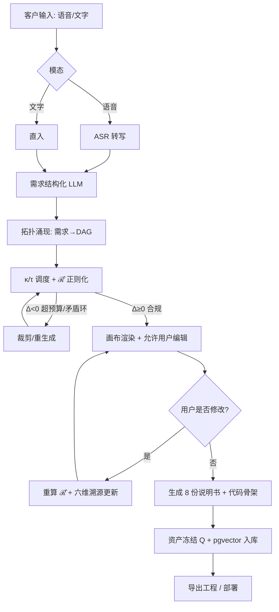

# PrimiFlow 主架构设计文档（Master Architecture）

> 版本：R1‑ARCH‑v1.0 ｜ 状态：设计冻结待评审
> 归一来源：`primiflow/SPEC.md` + 现有「算子统一系统」(`docs/`) 全套架构/业务/流程文档
> 一句话定位（对外话术）：**客户只管说话或打字，系统自动把需求变成可运行的系统，并随手改流程图。**

---

## 0. 对外最好的一句话说法（客户视角）

> 「你用说的、用打的，把想做的业务讲清楚；PrimiFlow 自动把它拆成需求树、画出业务流程图、生成数据表/接口/定时任务和全套说明书，还能一键导出代码骨架。流程图你随时拖一拖就能改，改完系统跟着变。不用画流程图、不用写提示词、不用懂架构。」

这就是核验报告里「命题2：仅靠自然语言完成整套系统开发」的客户可感知版本，且把"可编辑流程图"作为第一交互面（而非隐藏在后端）。

---

## 1. 客户旅程（Customer Journey）

```
[语音/文字输入]
      │  (ASR 语音→文本；文本直入)
      ▼
[需求结构化] ──κ/τ 滑块(稳定↔探索)──▶
      │
      ▼
[拓扑涌现 TopologyOperator]  →  DAG(节点=功能/模块, 边=依赖/数据流)
      │
      ▼
[正则化 ℛ̂]  →  Δ=C²−(κ²+τ²)≥0 合规裁剪，去爆炸/死锁/矛盾环
      │
      ├───────────────┐
      ▼               ▼
[可视化画布 Canvas]   [资产复用 Q：pgvector 检索历史拓扑]
  (Cytoscape 渲染+拖拽编辑)
      │ 用户可在此增删节点/改边/重算 ℛ̂
      ▼
[业务说明书生成] → [功能/数据/接口/定时任务/代码骨架/部署 8 文档]
      │
      ▼
[六维溯源 TraceLinks] 需求↔功能↔业务↔算法↔任务↔代码 全绑定可审计
      │
      ▼
[导出] 代码骨架工程 / 迁移包 / 可直接部署
```

**客户的两条主操作**：① 输入（语音/文字）；② 改流程图（画布）。其余全自动。

---

## 2. 分层架构（整合算子统一系统能力）

| 层 | PrimiFlow 组件 | 复用算子统一系统(OUS)能力 |
|----|----------------|---------------------------|
| 接入层 | 语音 ASR + 文本 ChatPanel | OUS `ChatView` 对话自动入图、统一搜索 |
| 运行时/编排 | Go orchestrator + scheduler(κ/τ+ℛ̂) | OUS `runtime`(Axum) 鉴权/限流/观测；`flow-ai` 拓扑/DAG 调度 |
| 算子层 | Python llm‑gateway / topology‑operator / doc‑generator / smoke‑tester | OUS `xuanji-expert` 多专家融合、`optimizer` DAG 关键路径、`business-catalog` 业务算子目录 |
| 数据/资产 | PostgreSQL + pgvector(资产 Q) | OUS 知识图谱(operator-graph) PageRank/社区发现可作 κ 复用信号 |
| 画布/前端 | React + Cytoscape‑js（可编辑） | OUS `GraphView` 力导向图、流程图 SVG 编辑器 |
| 插件/融合 | 功能数据插件总线（见 §4） | OUS `operator-wasm` 沙箱、`hermes-flow-bridge` 外部对接 |

> 设计原则：**PrimiFlow 是 OUS 的"自然语言前端 + 拓扑规划中枢"**，底层执行/编排/插件能力直接复用 OUS，不重复造轮子。

---

## 3. 业务流程图规划（核心闭环 Mermaid）



---

## 4. 功能数据插件体系（Functional Data Plugins）与关联融合

**插件分类**（统一接口 `Plugin`：`id / kind / in_schema / out_schema / invoke`）：
1. **连接器插件**（Connector）：数据库/API/消息队列/对象存储 → 输入即生成数据表/接口说明书。
2. **业务算子插件**（Operator）：复用 OUS `business-catalog` 的现成流程（发票核验/入职/采购…）作为 κ 复用资产。
3. **AI 能力插件**（Capability）：LLM 抽取、分类、摘要、代码生成，可热插拔不同模型。
4. **外部系统桥接插件**（Bridge）：复用 OUS `hermes-flow-bridge` 对接既有流系统。
5. **导出插件**（Exporter）：代码骨架(多语言)、迁移包、OpenAPI、部署清单。

**关联关系（怎么写关联关系）**：
- 每个插件声明 `produces: [artifact_kind]` 与 `consumes: [artifact_kind]`，编排层据此自动连线成 DAG。
- 插件间通过**标准化产物契约**（与 §8 八文档同构）解耦：A 插件的 `out_schema` 必须匹配 B 插件的 `in_schema`，否则 ℛ̂ 判定为非法边并告警。
- 关联图谱本身存入 `topologies.graph_json`，既是运行 DAG，也是可编辑画布。

**怎么融合（Fusion）**：
- **纵向融合**：语音→文本→需求→拓扑→代码，靠六维溯源 `trace_links` 串联，任一环节改动向前/向后传播。
- **横向融合**：多专家/多插件结果经 OUS `xuanji-expert` 归一化裁决，冲突用 κ/τ 权重调和（稳定取共识、探索取创新）。
- **资产融合**：每次合格产出冻结为 Q 资产，后续同类需求经 pgvector 相似度召回，κ 越高越优先复用 → 系统越用越"懂你业务"。

---

## 5. 怎么更好地开发这个系统（工程方法论）

1. **切片交付，先跑通主链路**：P0 先让"文字→拓扑→画布→8 文档"端到端跑通（用 Mock LLM，离线可跑），再接真实模型。
2. **可观测优先**：κ/τ 消耗、ℛ̂ 裁剪次数、资产命中率做成指标，证明"系统真的在收敛"而非随机生成。
3. **冒烟兜底**：任何 LLM 产出先过 schema 校验 + 冒烟测试，失败回写对话重生成，绝不静默放行（承接核验命题3）。
4. **插件化一切**：新能力以插件形式接入，主链路零改动；插件契约用 schema 版本管理。
5. **画布即源码**：用户编辑的画布 = 系统真实状态，导出即工程，避免"图是图、代码是代码"两张皮。
6. **域白名单**：MVP 仅放开业务软件域，超域任务显式拒绝，控制幻觉面。

---

## 6. 能力分层与范围（诚实声明）

| 层级 | 本期(R1) | 远期(V2+) |
|------|----------|-----------|
| 输入 | 文字 + 语音(ASR) | 脑机/意识直连(核验报告 V2 预留) |
| 生成 | 拓扑 + 画布 + 8 文档 + 代码骨架 | 完整可运行代码 + 自动测试 |
| 编辑 | 画布增删节点/边 + 重算 ℛ̂ | 双向同步(改代码反推图) |
| 复用 | κ 检索历史资产 Q | κ‑τ 强化学习自调参 |
| 公理 | 固定 C²=κ²+τ² | 系统自改公理/自拓原语(12/32维) |

> 如核验报告命题4 自陈：R1 是三维原语下人类可落地最优，非宇宙终极。

---

## 7. 与现有文档的关系（归一映射）

- 本文件 = `SPEC.md`(工程参数) + OUS `architecture.md`(总架构) + `business-process-flows.md`(执行引擎) + `market-module.md`(资产复用) + `xuanji-expert-*`(融合) 的**客户视角收敛版**。
- 代码落点：PrimiFlow 编排/算子层为新增；执行/画布/插件/融合层复用 OUS 既有 crate，避免重复。

---

*评审通过后据此立项。任何"关联关系/融合/客户旅程"变更须回填本节并 bump 版本。*
