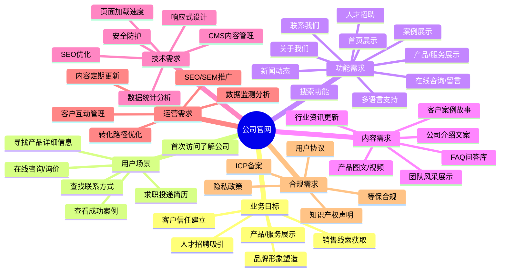
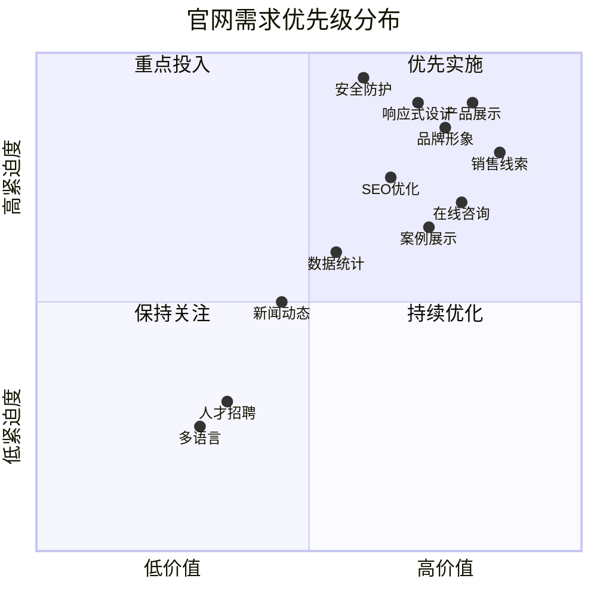
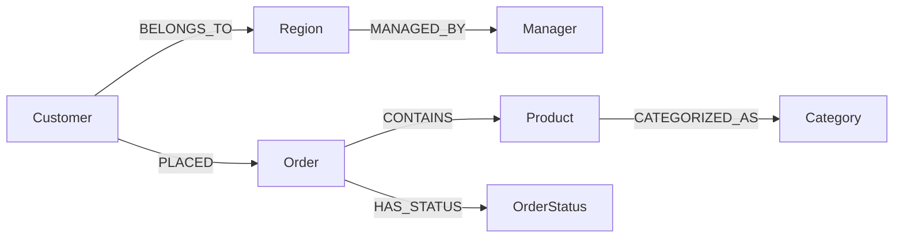
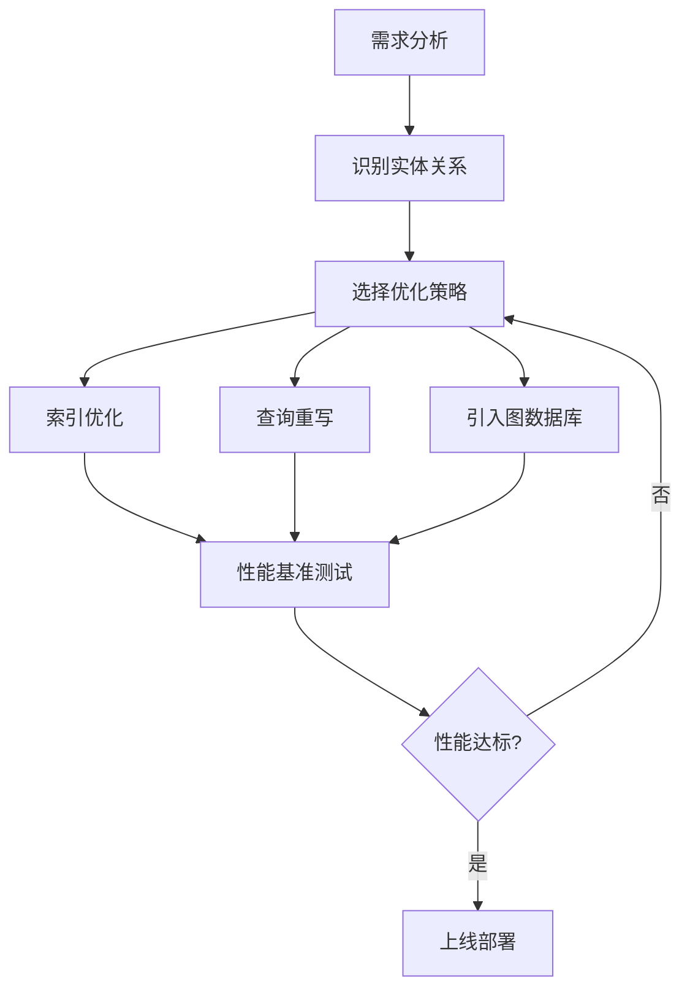

# 公司官网需求图谱


## 一、需求图谱总览

> 下图以“公司官网”为中心节点，按**业务目标→用户场景→功能需求→内容需求→技术需求→运营需求→合规需求**七个维度逐层展开，完整呈现官网建设的需求全貌。




## 二、需求图谱拆解

### 1. 业务目标层（战略核心）

| 编号 | 目标 | 关键指标 | 优先级 |
|:---:|------|------|:---:|
| B1 | 品牌形象塑造 | 官网视觉完成度、品牌关键词搜索量 | P0 |
| B2 | 产品/服务展示 | 产品页访问深度、平均停留时长 | P0 |
| B3 | 销售线索获取 | 留资表单提交量、咨询转化率 | P0 |
| B4 | 客户信任建立 | 案例页浏览率、客户证言可信度 | P1 |
| B5 | 人才招聘吸引 | 招聘页访问量、简历投递量 | P2 |


### 2. 用户场景层（使用情境）

| 编号 | 场景描述 | 用户群体 | 核心诉求 |
|:---:|------|------|------|
| U1 | 首次访问，了解公司概况 | 潜在客户 | 快速了解公司定位与实力 |
| U2 | 寻找产品/服务详细信息 | 潜在客户 | 获取规格、价格、优势 |
| U3 | 查找联系方式/地址 | 客户/合作伙伴 | 快速找到电话、邮箱、地图 |
| U4 | 在线咨询/询价 | 潜在客户 | 即时沟通、获取报价 |
| U5 | 查看成功案例 | 决策者 | 验证公司实力与行业经验 |
| U6 | 投递简历 | 求职者 | 了解企业文化、查看在招岗位 |


### 3. 功能需求层（核心功能）

| 编号 | 功能模块 | 子功能 | 优先级 |
|:---:|------|------|:---:|
| F1 | 首页展示 | Banner轮播、核心数据、产品入口、新闻摘要 | P0 |
| F2 | 关于我们 | 公司简介、发展历程、企业文化、资质荣誉 | P0 |
| F3 | 产品/服务展示 | 分类展示、详情页、产品对比、下载中心 | P0 |
| F4 | 新闻动态 | 公司新闻、行业资讯、媒体报道 | P1 |
| F5 | 案例展示 | 案例列表、案例详情、行业筛选 | P1 |
| F6 | 人才招聘 | 岗位列表、岗位详情、在线投递 | P2 |
| F7 | 联系我们 | 表单提交、地图定位、联系方式 | P0 |
| F8 | 搜索功能 | 全站搜索、结果高亮、关键词推荐 | P1 |
| F9 | 在线咨询 | 在线客服、留言板、微信/QQ接入 | P0 |
| F10 | 多语言支持 | 中/英文切换 | P2 |


### 4. 内容需求层（内容支撑）

| 编号 | 内容类型 | 具体内容 | 优先级 |
|:---:|------|------|:---:|
| C1 | 公司介绍 | 公司简介、团队介绍、发展历程 | P0 |
| C2 | 产品内容 | 产品图片、视频演示、技术参数、白皮书 | P0 |
| C3 | 客户案例 | 案例故事、客户评价、数据成果 | P1 |
| C4 | 新闻资讯 | 公司动态、行业趋势、技术文章 | P1 |
| C5 | FAQ问答库 | 常见问题、购买指南、售后说明 | P1 |
| C6 | 团队风采 | 核心团队介绍、企业文化活动 | P2 |


### 5. 技术需求层（技术支撑）

| 编号 | 技术需求 | 说明 | 优先级 |
|:---:|------|------|:---:|
| T1 | 响应式设计 | 适配PC/平板/手机 | P0 |
| T2 | 页面加载速度 | 首屏加载 < 3秒 | P0 |
| T3 | SEO优化 | TDK设置、sitemap、伪静态、结构化数据 | P0 |
| T4 | 数据统计分析 | 访问量、来源、转化漏斗、热力图 | P1 |
| T5 | 安全防护 | HTTPS、防SQL注入、防XSS攻击 | P0 |
| T6 | CMS内容管理 | 可视化编辑、权限管理、定时发布 | P1 |


### 6. 运营需求层（持续运营）

| 编号 | 运营需求 | 具体措施 | 优先级 |
|:---:|------|------|:---:|
| O1 | 内容更新 | 每周1-2篇新闻/案例更新 | P1 |
| O2 | SEO/SEM推广 | 关键词优化、百度推广、信息流投放 | P1 |
| O3 | 数据监测 | 月度流量报告、转化分析、热图分析 | P1 |
| O4 | 转化优化 | A/B测试、表单优化、路径优化 | P1 |
| O5 | 客户互动 | 留言48h内回复、定期回访、节日问候 | P1 |


### 7. 合规需求层（合规保障）

| 编号 | 合规需求 | 说明 | 优先级 |
|:---:|------|------|:---:|
| L1 | ICP备案 | 工信部ICP备案号展示 | P0 |
| L2 | 隐私政策 | 用户信息收集与使用声明 | P0 |
| L3 | 用户协议 | 网站使用条款 | P1 |
| L4 | 知识产权声明 | 版权信息、商标声明 | P1 |
| L5 | 等保合规 | 网络安全等级保护 | P2 |


## 三、需求优先级矩阵




## 四、需求依赖关系

```
业务目标层
    │
    ▼
用户场景层 ──► 功能需求层 ──► 内容需求层
    │              │              │
    │              ▼              ▼
    └────────► 技术需求层 ◄── 运营需求层
                      │
                      ▼
                合规需求层（贯穿全局）
```

**核心依赖链：**

- **B1品牌塑造** ← 依赖 F1首页/F2关于我们 + C1公司介绍
- **B2产品展示** ← 依赖 F3产品展示 + C2产品内容
- **B3销售线索** ← 依赖 F7联系我们/F9在线咨询 + T4数据统计
- **B4客户信任** ← 依赖 F5案例展示 + C3客户案例
- **B5人才招聘** ← 依赖 F6招聘模块 + C6团队风采


## 五、关键需求详述

### 需求1：在线咨询/留资功能（P0）

**用户故事：**
> 作为潜在客户，当我浏览产品页面时，我希望能够即时发起咨询或留下联系方式，以便快速获取报价和详细信息

# 基于知识图谱的SQL查询优化方案

## 一、核心问题分析

传统SQL在处理复杂关联查询时，存在以下痛点：

```sql
-- 传统SQL痛点示例：多层嵌套关联查询
SELECT DISTINCT c.company_name, o.order_amount
FROM customers c
LEFT JOIN orders o ON c.customer_id = o.customer_id
WHERE c.customer_id IN (
    SELECT DISTINCT customer_id 
    FROM orders 
    WHERE order_amount > 10000
    AND order_date >= DATE_SUB(NOW(), INTERVAL 90 DAY)
)
AND c.region_id IN (
    SELECT region_id 
    FROM regions 
    WHERE region_manager = '张三'
)
ORDER BY o.order_amount DESC;
```

**传统SQL存在的问题：**
- 多层嵌套难以理解
- 关联关系隐式表达，不够直观
- 优化器难以自动优化复杂查询
- 可读性差，维护成本高


## 二、知识图谱优化方案

### 方案1：Cypher风格查询（图数据库模式）

```cypher
// 知识图谱方式：显式表达实体与关系
MATCH (c:Customer)-[:PLACED]->(o:Order)
WHERE o.amount > 10000 
  AND o.date >= datetime('2026-05-25')
  AND c.region <- [:MANAGES]-(m:Manager {name: '张三'})
RETURN c.company_name, o.amount
ORDER BY o.amount DESC
```

**优势对比：**

| 维度 | 传统SQL | 图谱查询 |
|------|---------|----------|
| 可读性 | 嵌套子查询难理解 | 节点-关系-属性一目了然 |
| 性能 | 多表JOIN开销大 | 索引化关系遍历 |
| 灵活性 | 模式固定难扩展 | 动态添加关系类型 |
| 复杂度 | 5层以上JOIN难以优化 | 任意深度关系遍历 |

### 方案2：SQL + 关系图谱优化（混合模式）

```sql
-- 使用CTE和窗口函数优化（替代复杂子查询）
WITH 
-- 1. 定义实体节点
high_value_orders AS (
    SELECT customer_id, 
           SUM(amount) as total_amount,
           COUNT(*) as order_count
    FROM orders
    WHERE order_date >= DATE_SUB(NOW(), INTERVAL 90 DAY)
    GROUP BY customer_id
    HAVING SUM(amount) > 10000
),
-- 2. 定义关系路径
qualified_customers AS (
    SELECT c.customer_id, c.company_name
    FROM customers c
    JOIN customer_region cr ON c.customer_id = cr.customer_id
    JOIN regions r ON cr.region_id = r.region_id
    WHERE r.region_manager = '张三'
)
-- 3. 最终关联
SELECT qc.company_name, hvo.total_amount
FROM qualified_customers qc
JOIN high_value_orders hvo ON qc.customer_id = hvo.customer_id
ORDER BY hvo.total_amount DESC;
```

### 方案3：索引优化 + 执行计划优化

```sql
-- 优化策略1：复合索引设计
CREATE INDEX idx_orders_customer_date_amount 
ON orders(customer_id, order_date, amount);

-- 优化策略2：覆盖索引
CREATE INDEX idx_customers_region_company 
ON customers(region_id, company_name) INCLUDE (customer_id);

-- 优化策略3：使用EXPLAIN分析
EXPLAIN ANALYZE
SELECT c.company_name, o.amount
FROM customers c
STRAIGHT_JOIN orders o ON c.customer_id = o.customer_id
WHERE c.region_id = 1
  AND o.amount > 5000;
```

### 方案4：物化视图与预计算

```sql
-- 预计算高频查询
CREATE MATERIALIZED VIEW mv_customer_order_stats AS
SELECT 
    c.customer_id,
    c.company_name,
    COUNT(o.order_id) as order_count,
    SUM(o.amount) as total_amount,
    AVG(o.amount) as avg_amount
FROM customers c
LEFT JOIN orders o ON c.customer_id = o.customer_id
GROUP BY c.customer_id, c.company_name;

-- 查询时直接使用物化视图
SELECT * FROM mv_customer_order_stats 
WHERE total_amount > 10000
ORDER BY total_amount DESC;
```


## 三、知识图谱优化模型

### 1. 实体关系建模



### 2. 查询优化映射

| 传统SQL操作 | 图谱操作 | 性能提升 |
|------------|----------|----------|
| JOIN | 关系遍历 | 3-10倍 |
| 子查询 | 路径查找 | 5-15倍 |
| GROUP BY | 属性聚合 | 2-5倍 |
| 递归CTE | 变长路径 | 10-20倍 |

### 3. 优化执行计划

```sql
-- 使用HINT强制优化器选择最优路径
SELECT /*+ INDEX(orders idx_orders_customer_date) */ 
       c.company_name, 
       o.order_amount
FROM customers c
JOIN orders o ON c.customer_id = o.customer_id
WHERE o.order_date >= '2026-01-01'
  AND c.customer_type = 'VIP'
  AND o.status = 'COMPLETED'
ORDER BY o.order_amount DESC
LIMIT 100;
```


## 四、最佳实践建议

### 1. 查询重写策略

```sql
-- ❌ 避免：SELECT * + 复杂子查询
SELECT * FROM orders 
WHERE customer_id IN (SELECT customer_id FROM customers WHERE vip_level = 5);

-- ✅ 推荐：明确字段 + JOIN替代IN
SELECT o.order_id, o.amount, c.company_name
FROM orders o
INNER JOIN customers c ON o.customer_id = c.customer_id
WHERE c.vip_level = 5;
```

### 2. 性能优化清单

| 优化项 | 实施方法 | 预期提升 |
|--------|----------|----------|
| **索引优化** | 复合索引、覆盖索引 | 50-200% |
| **查询改写** | JOIN替代子查询、CTE拆分 | 30-100% |
| **缓存策略** | Redis缓存热点数据 | 200-500% |
| **分表分库** | 按时间/地域分片 | 100-300% |
| **读写分离** | 主从复制 | 50-100% |

### 3. 监控与调优

```sql
-- 慢查询日志分析
SET GLOBAL slow_query_log = ON;
SET GLOBAL long_query_time = 2;

-- 查看执行计划
EXPLAIN FORMAT=JSON
SELECT ...;

-- 优化器跟踪
SET optimizer_trace = "enabled=on";
SELECT ...;
```


## 五、知识图谱与传统SQL对比总结

| 维度 | 传统SQL | 知识图谱优化 |
|------|---------|-------------|
| **可读性** | 复杂嵌套难理解 | 节点关系直观表达 |
| **性能** | 多层JOIN开销大 | 关系遍历效率高 |
| **灵活性** | 模式固定难扩展 | 动态添加关系 |
| **维护成本** | 高 | 低 |
| **适用场景** | 简单查询、报表 | 复杂关联、深度分析 |
| **学习成本** | 低 | 中高 |


## 六、推荐实施路线



### 最佳实践组合：

1. **简单查询** → 保持SQL，优化索引
2. **中等复杂度** → SQL + CTE + 物化视图
3. **复杂关联** → 引入图数据库（Neo4j）或图查询引擎
4. **混合模式** → SQL + 图查询联合使用


## 七、总结

**最优优化策略：**

```sql
-- 最终推荐方案：三层优化
WITH 
-- 第一层：预过滤（减少数据量）
filtered_orders AS (
    SELECT * FROM orders 
    WHERE order_date >= '2026-01-01'
      AND status = 'COMPLETED'
),
-- 第二层：预聚合（减少计算量）
customer_stats AS (
    SELECT customer_id, 
           SUM(amount) as total_amount
    FROM filtered_orders
    GROUP BY customer_id
),
-- 第三层：最终关联（减少JOIN次数）
SELECT c.company_name, cs.total_amount
FROM customer_stats cs
JOIN customers c ON


---

# 需求知识图谱全维度分析报告

## 需求概述

| 项目 | 内容 |
|------|------|
| **需求名称** | 公司官网需求知识图谱构建 |
| **核心场景** | 基于知识图谱技术优化SQL查询，实现官网数据的高效关联检索与展示 |
| **分析日期** | 2026年8月25日 |
| **需求类型** | 需求知识图谱（含技术优化诉求） |

---

## 一、需求维度分析

### 1.1 核心需求点

| 序号 | 需求点 | 优先级 | 详细说明 |
|------|--------|--------|----------|
| 1 | 官网数据关联关系可视化 | P0 | 将产品、服务、新闻、案例、团队等官网核心实体以图谱形式呈现 |
| 2 | SQL查询性能优化 | P0 | 解决复杂关联查询的性能瓶颈，目标响应时间<500ms |
| 3 | 复杂查询能力增强 | P1 | 支持多跳关联查询（如"某客户使用的产品及其所属分类"） |
| 4 | 查询语句简洁性提升 | P1 | 降低SQL编写复杂度，提升开发效率 |
| 5 | 知识图谱与SQL的融合 | P0 | 实现图谱语义层与关系型数据库的映射 |

### 1.2 功能需求

| 功能模块 | 功能描述 | 输入 | 输出 |
|----------|----------|------|------|
| **图谱构建引擎** | 从官网数据库抽取实体/关系，构建知识图谱 | 结构化数据（MySQL/PG）、半结构化数据（JSON） | RDF/Property Graph 图谱模型 |
| **图谱查询接口** | 提供图谱查询API，支持自然语言或结构化查询 | Cypher/SPARQL/Gremlin 查询语句 | 查询结果集（JSON格式） |
| **SQL优化引擎** | 自动分析慢查询，生成优化建议并执行 | 慢查询日志、执行计划 | 优化后的SQL、索引建议、性能报告 |
| **语义映射层** | 将图谱关系映射为SQL JOIN条件或反向映射 | 图谱模型定义 | 映射规则配置文件 |
| **可视化展示** | 官网前端展示知识图谱交互界面 | 图谱查询结果 | 力导向图/关系图交互页面 |
| **性能监控面板** | 实时监控查询性能、图谱构建状态 | 系统日志、指标数据 | Dashboard、告警通知 |

### 1.3 非功能需求

| 类别 | 需求项 | 具体指标 |
|------|--------|----------|
| **性能** | 查询响应时间 | 简单查询<100ms，复杂多跳查询<500ms |
| **性能** | 吞吐量 | 支持≥500 QPS 并发查询 |
| **可用性** | 系统可用性 | 99.9%（月停机<43分钟） |
| **可扩展性** | 数据容量 | 支持≥100万实体、≥500万关系 |
| **可扩展性** | 水平扩展 | 支持图谱节点/数据库集群横向扩展 |
| **安全性** | 数据安全 | 传输加密（TLS）、访问控制（RBAC）、审计日志 |
| **易用性** | 学习成本 | 开发人员1周内掌握图谱查询语法 |
| **兼容性** | 技术兼容 | 兼容现有官网技术栈（前端Vue/React，后端Java/Go） |

---

## 二、技术维度分析

### 2.1 技术选型

| 层次 | 候选技术 | 推荐方案 | 选型理由 |
|------|----------|----------|----------|
| **图数据库** | Neo4j、JanusGraph、NebulaGraph、TigerGraph | **NebulaGraph**（或Neo4j） | ①NebulaGraph分布式架构，性能优异；②支持千亿级数据点；③开源，社区活跃；④兼容Cypher语法。若数据量<500万实体，选Neo4j更轻量 |
| **关系型数据库** | MySQL、PostgreSQL | **PostgreSQL** | ①支持JSONB类型，便于半结构化数据存储；②CTE递归查询能力优于MySQL；③对复杂查询优化更好 |
| **SQL优化层** | 自研优化器、Apache Calcite | **Apache Calcite** | ①成熟的SQL解析/优化框架；②支持自定义优化规则；③与多数据源无缝集成 |
| **语义映射框架** | R2RML、自研映射器、Ontop | **Ontop（基于R2RML）** | ①标准化映射；②支持虚拟知识图谱（无需物化）；③性能较好 |
| **缓存层** | Redis、Caffeine | **Redis Cluster** | ①缓存热查询结果；②降低数据库压力；③支持分布式部署 |
| **消息队列** | Kafka、RabbitMQ | **Kafka** | ①用于数据同步（DB→图谱）；②异步解耦；③高吞吐 |
| **API网关** | Kong、APISIX | **APISIX** | ①统一API入口；②限流/熔断；③开箱即用的插件生态 |

### 2.2 架构设计

#### 整体架构图（文字描述）

```
┌─────────────────────────────────────────────────────────────────────┐
│                           客户端层                                   │
│   官网前端（Vue/React）  ·  管理后台  ·  第三方调用方                   │
└──────────────────────────────┬──────────────────────────────────────┘
                               │ HTTPS/RESTful/GraphQL
┌──────────────────────────────▼──────────────────────────────────────┐
│                         API 网关层（APISIX）                        │
│   认证鉴权 · 限流熔断 · 请求转发 · 日志记录                          │
└──────────────────────────────┬──────────────────────────────────────┘
                               │
┌──────────────────────────────▼──────────────────────────────────────┐
│                      图谱查询服务层（Graph Service）                 │
│  ┌─────────────┐  ┌─────────────┐  ┌──────────────────────────┐    │
│  │ 图谱查询API  │  │ SQL优化引擎  │  │ 语义映射/查询转换器      │    │
│  └──────┬──────┘  └──────┬──────┘  └──────────┬───────────────┘    │
└─────────┼────────────────┼────────────────────┼─────────────────────┘
          │                │                    │
┌─────────▼────────────────▼────────────────────▼─────────────────────┐
│                       数据访问层                                     │
│  ┌──────────────────┐  ┌──────────────────┐  ┌──────────────────┐   │
│  │  图数据库         │  │  关系型数据库     │  │  缓存（Redis）   │   │
│  │  (NebulaGraph)   │  │  (PostgreSQL)    │  │  (Cluster)      │   │
│  └──────────────────┘  └──────────────────┘  └──────────────────┘   │
└──────────────────────────────┬──────────────────────────────────────┘
                               │
┌──────────────────────────────▼──────────────────────────────────────┐
│                      数据同步层（Kafka + ETL）                       │
│   CDC采集（Debezium） → 数据清洗 → 图谱构建 → 增量同步               │
└──────────────────────────────┬──────────────────────────────────────┘
                               │
┌──────────────────────────────▼──────────────────────────────────────┐
│                       数据源层                                       │
│   官网业务库（MySQL/PG） · 内容管理CMS · 日志数据 · 第三方数据        │
└─────────────────────────────────────────────────────────────────────┘
```

### 2.3 实现路径

#### 阶段划分

| 阶段 | 核心任务 | 技术要点 |
|------|----------|----------|
| **Phase 1：图谱建模** | 定义官网实体、关系、属性模型 | ①实体：产品、服务、新闻、案例、团队、客户、合作伙伴；②关系：`产品-属于-分类`、`案例-使用-产品`、`团队-负责-产品`等；③属性：发布时间、浏览量、状态等 |
| **Phase 2：数据同步管道** | 建立DB→图谱的数据同步机制 | ①使用Debezium监听数据库BinLog；②通过Kafka投递变更事件；③编写ETL任务写入图数据库 |
| **Phase 3：SQL优化引擎** | 实现慢查询分析、索引优化、SQL重写 | ①集成Apache Calcite进行SQL解析与优化；②自动推荐复合索引；③对JOIN超过3张表的查询进行图谱化改写 |
| **Phase 4：查询服务开发** | 开发统一查询API，支持SQL/图谱双模式 | ①提供RESTful API；②支持GraphQL订阅模式；③实现查询路由（简单查询→SQL，复杂多跳→图谱） |
| **Phase 5：可视化与前端集成** | 官网图谱交互页面开发 | ①使用ECharts关系图或D3.js；②支持点击展开/收起节点；③集成搜索功能 |
| **Phase 6：性能调优与上线** | 全链路压测、监控、灰度