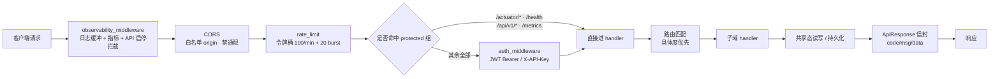
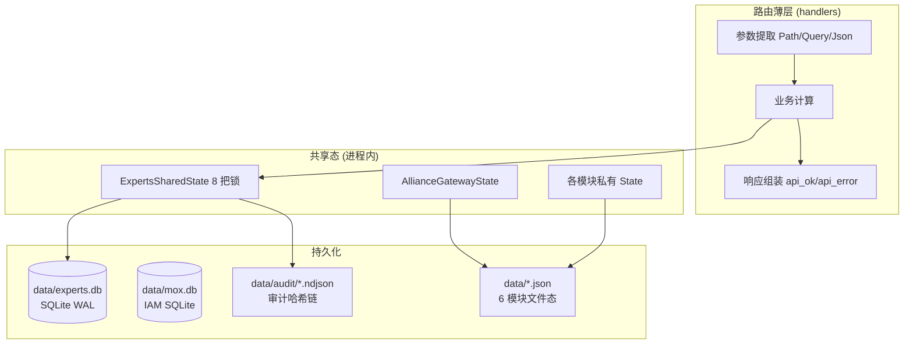
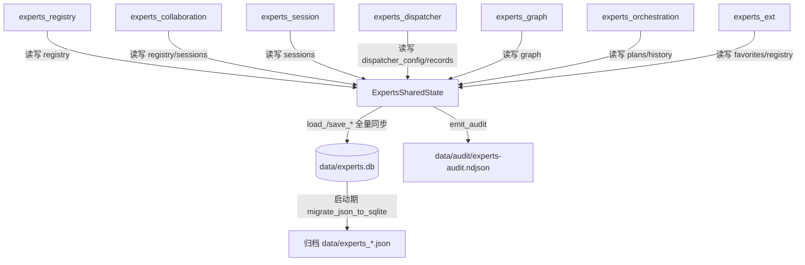
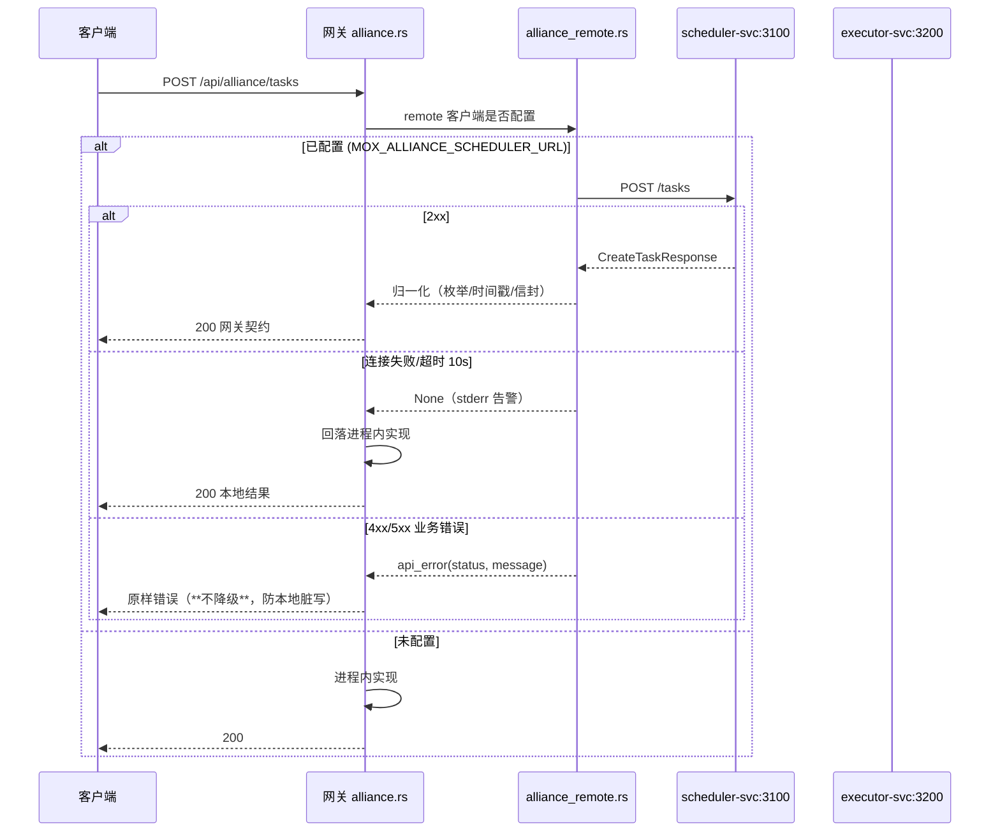

# 网关架构模块逻辑处理流程 · 整理分析与优化报告

> **范围**：`platform/gateway/mox-platform-gateway-svc`（MOX L1 企业级网关 · Rust/Axum 单二进制）
> **版本**：V1.0
> **日期**：2026-09-05
> **性质**：整理（现状盘点）→ 分析（流程建模 + 问题诊断）→ 优化（本轮实施 + 后续路线）

---

## 一、工作摘要

| 阶段 | 交付 |
|------|------|
| 整理 | 27 个源文件 / 16330 行 / 21 个路由装配单元的完整职责盘点（§二、§三） |
| 分析 | 请求主流程 + 5 大业务域处理流程建模（§三、§四），22 项架构问题分级诊断（§五） |
| 优化 | 第一轮落地 5 项零/低风险收口（§六）；第二轮落地企业级布局归一化 4 项（§九），含模块装配层 `modules.rs` |
| 路线 | 剩余 15 项按 P0/P1/P2 排出，含风险与工作量，待确认后实施（§七、§九.4） |

> **第二轮（企业级布局归一化）已完成**，详见 §九：新增模块装配层 `modules.rs`，
> 把共享状态构造、21 个路由单元 merge、状态类型升级从 `lib.rs` 收敛为单一入口，
> 并把联盟域状态映射表归一为单一真源。全量测试 79 + 8 + 10 全绿。

---

## 二、模块规模盘点

### 2.1 规模分布（Top 12）

| 文件 | 行数 | 定位 |
|------|------|------|
| `system.rs` | 1735 | 系统/安全域（IAM SQLite 真实链路） |
| `experts_collaboration.rs` | 1625 | 专家智能协作域 |
| `alliance.rs` | 1345 | 联盟任务域（本地实现 + 远程钩子） |
| `experts_dispatcher.rs` | 1060 | 专家调度引擎域 |
| `actuator.rs` | 1043 | 管理面（日志/指标/启停/SSE） |
| `experts_orchestration.rs` | 964 | 专家编排引擎域 |
| `experts_graph.rs` | 940 | 能力图谱域 |
| `experts_common.rs` | 936 | 专家域共享基础层 |
| `experts_session.rs` | 873 | 会话域 |
| `experts_registry.rs` | 857 | 注册中心域 |
| `alliance_remote.rs` | 739 | 联盟远程接入层 |
| `experts_db.rs` | 676 | 专家域 SQLite 持久化层 |

专家联盟域（7 模块 + common + db）合计 **8012 行**，占网关 49%，是当前网关的绝对主体，也是本次优化的重点。

### 2.2 路由装配单元（21 个）

| 类别 | Router | 路径前缀 | 状态 |
|------|--------|----------|------|
| 管理面 | `actuator` | `/actuator/*` | 真实（公开，无限流/无鉴权） |
| L0 通用 | `l0`（内联） | `/health`、`/api/v1/*`、`/metrics` | 真实 |
| 领域外挂 | `kg_ai`（`http_adapter`） | `/kg/v1/*`、`/ai/engine/*` | 真实 |
| 领域外挂 | `kb`（`mox-kb-svc`） | `/api/kb/*`（`nest` 包装） | 真实 |
| 业务域 | `alliance` | `/api/alliance/*` | 真实（远程优先 + 本地降级） |
| 业务域 | `system` / `security` | `/api/system/*`、`/api/security/*` | 真实（IAM） |
| 适配层 | `business_proxy` | `/api/*`（兜底反代 :3001） | 真实 |
| 专家域 | `experts_registry` 等 6 个 | `/api/experts/*`、`/api/expert-graph/*` | 真实 |
| 专家域 | `experts_ext` | `/api/experts/bookings*` | 真实（本轮收口） |
| 占位模块 | `monitor`/`workspace`/`projects_ext`/`misc`/`kb_ext` | `/api/monitor/*` 等 | 大量硬编码假数据 |
| 真实小模块 | `notification` | `/api/notifications/*` | 真实 |

---

## 三、请求处理主流程

### 3.1 中间件洋葱模型

`axum` 的 `.layer()` 后注册者先执行，因此 `lib.rs` 中「先写限流、后写 CORS、最后写可观测」的代码顺序，运行时**实际执行序相反**：



**关键点**：`protected` 组用 `route_layer(from_fn(auth))` 挂载，所以**只有业务路由走鉴权**；`/actuator/*` 与 L0 端点绕过鉴权与限流（见问题 P0-02）。

### 3.2 域内三段式处理流程

网关各业务模块统一遵循「**路由薄层 → 共享态 → 持久化**」三段式：



### 3.3 专家联盟域数据闭环



**依赖形态**：6 个子模块全部以 `use super::experts_common::*;` 通配符导入共享层，构成**星形依赖**（子模块互不依赖，全部汇聚到 `experts_common`）。优点是杜绝循环依赖，缺点是共享层职责膨胀（领域模型 + 共享态 + 审计 + 持久化委托 + 种子数据 + 通用算法共 8 个章节挤在一个 936 行文件）。

---

## 四、域处理流程分解

### 4.1 联盟任务域：远程优先 + 本地降级



降级语义设计正确：传输层故障降级（可用性优先），业务层错误直返（一致性优先），是本次分析中**处理最规范的模块**，可作为其他域的参考范式。

### 4.2 其余域要点

| 域 | 处理流程 | 评价 |
|----|----------|------|
| 系统/安全 | handler → `IamRepository` → SQLite(`data/mox.db`) | 真实链路，唯一走 Repository 模式的域 |
| 专家联盟 | handler → 共享态 → `experts_db` 事务全量同步 + 审计链 | 完整，但每次 save 为全量 DELETE+INSERT |
| 联盟任务 | 远程优先 + 本地降级 + 归一化 | 规范 |
| 管理面 Actuator | 环形日志缓冲 + 运行时指标 + SSE | 真实且自洽 |
| 监控/工作区/项目扩展/misc/KB 扩展 | handler → 内存硬编码 → 假数据响应 | 占位，需真实化 |

---

## 五、架构问题诊断

### 5.1 P0 级（安全 / 正确性）

| ID | 问题 | 证据 | 影响 |
|----|------|------|------|
| P0-01 | **JWT 只解 base64 不验签**：`validate_token` 解析 payload 后直接信任 claims，任何三段式字符串都能构造任意 `sub`/`roles` | `auth.rs:56-83` | 可伪造身份与角色，越权 |
| P0-02 | **管理面端点裸奔**：`/actuator/api/:id/enable|disable` 在 `protected` 之外，既不限流也不鉴权 | `lib.rs:266-269`、`actuator.rs:715-717` | 攻击者可远程停用任意 API |
| P0-03 | **dev_mode 放行任意非空令牌为 admin** | `auth.rs:108-119` | 若生产误开 `dev_mode` 则全线失守 |
| P0-04 | **公开路径白名单失效**：`public_paths` 含 `/api/auth/login`、`/api/auth/register`，但网关无此路由，请求落入 protected 内的 proxy 被 401 拦截 | `config.rs:45-49`、`lib.rs:216` | 登录入口实际不可用 |
| P0-05 | **收藏数据分裂**：`experts_ext` 私有 `ExpertsState.favorites`，与 `ExpertsSharedState.favorites` 各存一份，共享态那份无写入方（死字段） | `experts_ext.rs:61`（优化前） | 收藏状态不一致、重启即丢 | **✅ 本轮已修** |

### 5.2 P1 级（架构一致性）

| ID | 问题 | 证据 |
|----|------|------|
| P1-01 | ~~**9 套独立状态容器**~~ | 各模块文件 | **✅ 已完成（全量纳管）**：9 套状态容器中的 7 套业务域状态已纳入 `modules::ModuleStates` 注册中心统一构造与托管（专家联盟共享态 + monitor/workspace/projects/misc/kb_ext/notification），路由构建器改为接收 `Arc<State>`、不再各自 `new`，编译期强制单一真源（详见 §8.7）。剩余 `GatewayState` / `AllianceGatewayState` 为框架级状态，保持独立合理 |
| P1-02 | **持久化三分裂**：IAM 走 SQLite、专家域走 SQLite、其余 6 模块走各自 JSON 文件 | `lib.rs:112`、`monitor.rs`、`workspace.rs`、`projects_ext.rs`、`misc.rs`、`kb_ext.rs`、`notification.rs` | **✅ 已完成（2026-09-05）**：新增 `store_json` 归一化层（`data/store.db`，WAL + 事务 upsert），6 模块（monitor/notification/workspace/kb_ext/misc/projects_ext）的散落 JSON 读写统一收敛到集合模型（`load_collection` / `save_collection`）；旧 JSON 首次启动自动迁移并归档（`*.json.migrated-<ts>`），容错与原 JSON 一致（失败仅 stderr 不阻断）。详见 §8.8 |
| P1-03 | **跨模块直读他人数据文件**：`projects_ext` 直接读 `data/misc_data.json` | `projects_ext.rs:444` |
| P1-04 | **共享层职责膨胀**：`experts_common.rs` 一文件承载 8 类职责（模型/状态/审计/持久化委托/种子/算法/工具/常量） | `experts_common.rs:30-936` |
| P1-05 | ~~**归一化映射表三处重复**~~ | `alliance.rs:783-788, 883-890`（内联 match）+ `alliance_remote.rs:205-223`（字符串表） | **✅ 第二轮已解决**：状态映射收敛为 `EXPERT_STATUS_NORM` / `NODE_STATUS_NORM` 单一真源，新增一致性用例强制对齐 |
| P1-06 | **路由元数据失真**：`routes.rs` 的 `DOMAINS` 描述与实际挂载不符（如 `/s3` 标 ready 却无路由；联盟域标 `/alliance/v1/*` 实为 `/api/alliance/*`） | `routes.rs:43-99` vs `alliance.rs:1422` |
| P1-07 | **`with_state(())` 重复 17 处**：axum 0.7 无 `From<Router<()>>`，每个自包含 Router 都要手动升级 | `lib.rs:191-208` |
| P1-08 | **预约专家名硬编码**：`create_booking` 用 `format!("专家-{}", id)` 生成展示名，不校验专家是否存在 | `experts_ext.rs:172`（优化前） | **✅ 本轮已修** |

### 5.3 P2 级（清理 / 可维护性）

| ID | 问题 | 证据 | 状态 |
|----|------|------|------|
| P2-01 | **死代码文件 `routing.rs`**：自研 `Router`（与 axum 同名）从未被 `mod` 声明，从不编译 | 原 `routing.rs:41` | **✅ 本轮已删** |
| P2-02 | **占位假数据泛滥**：monitor 指标全 0、workspace KPI 全 0、projects_ext 空 Vec、kb_ext 搜索恒空 | 见 §二 表 | 待真实化 |
| P2-03 | **`o11y.rs` 空实现**：`increment_counter`/`record_histogram` 空函数体，`config` 字段从未读取，`GatewayState.metrics` 全仓无消费者 | `o11y.rs:24,33-39` | 待接入或删除 |
| P2-04 | ~~**`config.rs` 死配置**~~ | —— | **误判撤回**：`RoutingConfig.path_routing` / `header_routing` 实际被 `/actuator/env` 消费（`actuator.rs:885-886`）。本轮一度删除后编译报错，已完整恢复；教训是「仅搜类型名不足以判定死代码，必须搜字段访问」 |
| P2-05 | **`experts_ext` 四个占位 handler 已成死代码**（stats/consult-room/team/consult-now 已被 registry 真实版取代） | 原 `experts_ext.rs:84-286` | **✅ 本轮已删** |
| P2-06 | **双重加锁**：`create_booking` 对同一 `bookings` 连续两次 `lock()` | 原 `experts_ext.rs:180-184` | **✅ 本轮已修** |
| P2-07 | **通配符导入**：6 个 experts 子模块均 `use super::experts_common::*;`，符号来源不可追溯 | 各模块第 15-32 行 | 建议显式导入 |
| P2-08 | **`my_bookings` 无用户维度过滤**、预约 `user_id` 硬编码 `admin-user` | `experts_ext.rs:117`、`create_booking` | 需引入鉴权上下文 |
| P2-09 | **保存为全量 DELETE+INSERT**：专家域每次写整表重写，随数据量增长线性劣化 | `experts_db.rs:185,271,368,488` | 建议增量 upsert |

---

## 六、本轮已实施优化

| # | 优化项 | 改动 | 效果 |
|---|--------|------|------|
| 1 | **收藏状态归一化** | `experts_ext::ExpertsState` 改为持有 `Arc<ExpertsSharedState>`，删除私有 `favorites`；`build_experts_ext_router(shared)` 由 `lib.rs` 注入同一份共享态 | 消除 P0-05 数据分裂，收藏成为全域唯一真源 |
| 2 | **预约专家名真实化 + 存在性校验** | 新增纯函数 `resolve_expert_name()`，从 `registry` 取真实 `name`；未注册返回 404、已禁用返回 400，不再产生悬空预约 | 消除 P1-08 脏数据 |
| 3 | **临界区合并** | `create_booking` 由「push 后再次 lock 落盘」改为单次 `lock()` 内完成内存更新 + 持久化 | 消除 P2-06，缩短持锁窗口 |
| 4 | **死代码清理** | 删除 `routing.rs`（未编译的自研 Router）；删除 `experts_ext` 中 4 个已被 registry 取代的占位 handler 及其 2 个请求体结构体 | 消除 P2-01、P2-05，减少 152 行误导性代码 |
| 5 | **装配顺序修正** | `lib.rs` 中 `experts_shared` 上移至 `experts_ext_router` 之前创建并注入 | 支撑优化 1，并加注释说明顺序约束 |

### 6.1 验证结果

```
cargo check  -p mox-platform-gateway-svc --all-targets   → Finished, exitCode 0
cargo clippy -p mox-platform-gateway-svc --all-targets   → exitCode 0（无新增告警）
cargo test   -p mox-platform-gateway-svc
  ├ lib                           74 passed / 0 failed  （原 71，新增 3）
  ├ experts_db_persistence         8 passed / 0 failed
  └ alliance_remote_integration   10 passed / 0 failed
```

### 6.2 新增回归用例

| 用例 | 断言 |
|------|------|
| `experts_ext::tests::test_resolve_expert_name` | 命中返回真实姓名；未注册报 `not found` |
| `experts_ext::tests::test_resolve_expert_name_rejects_disabled` | 已禁用专家报 `disabled` |
| `experts_ext::tests::test_toggle_favorite_writes_shared_state` | 收藏写入 `ExpertsSharedState.favorites`，二次调用取消（直接构造状态，不触碰 SQLite） |

---

## 七、后续优化路线（待确认）

### P0 安全收口（建议 1 周内）

| 项 | 方案 | 风险 |
|----|------|------|
| JWT 验签 | 用 `jsonwebtoken` 校验 HS256 签名 + `exp`/`nbf`，`validate_token` 返回 `Result` 区分「无效」与「过期」 | 需确保前端令牌签发方密钥一致；灰度期可加 `MOX_AUTH_STRICT` 开关 |
| Actuator 鉴权 | 把 `/actuator/*` 移入 `protected`，或单独挂 `require_admin` 中间件（保留 `/actuator/health` 公开） | 运维脚本需补令牌 |
| public_paths 修正 | 删除不存在的 `/api/auth/*` 白名单，或补齐登录路由 | 需确认登录入口由网关还是编排器提供 |

### P1 架构收口（建议 2-3 周）

1. **状态注册中心**（**✅ 已完成 2026-09-05**）：`ModuleStates` 注册中心已纳管全部 7 套业务域状态（专家联盟共享态 + monitor/workspace/projects/misc/kb_ext/notification），路由构建器改为接收 `Arc<State>`、不再各自 `new`，编译期强制唯一真源；状态创建时机统一，可统一托管与观测。
2. **持久化归一**：6 个 JSON 模块迁移到 `experts_db` 同款 SQLite 模式（WAL + 事务）—— ✅ 已完成（`store_json` 归一化层，详见 §8.8）。
3. **共享层拆分**：`experts_common.rs` 按职责拆为 `experts_model` / `experts_state` / `experts_audit` / `experts_seed`，保留原路径 re-export 以保证编译兼容。
4. **归一化表单一化**：`alliance.rs` 的映射统一改调 `alliance_remote::norm_*`。
5. **`routes.rs` 校正或删除**：与真实路由对齐，否则 `status/domains` 接口返回误导性元数据。

### P2 清理与真实化（建议按业务优先级排期）

- 占位模块真实化：monitor（接 Prometheus）、workspace、projects_ext、misc、kb_ext。
- `o11y.rs` 二选一：接入 Prometheus 指标，或删除并移除 `GatewayState.metrics`。
- 保存策略优化：全量同步改增量 upsert（`experts_db`）。
- 引入鉴权上下文后，`my_bookings` 按 `user_id` 过滤。

---

## 八、第二轮：企业级布局模块化归一化

### 8.1 归一化目标与落点

| 归一化维度 | 归一化前 | 归一化后 |
|------------|----------|----------|
| 装配职责 | `lib.rs` 同时承担状态创建、21 个路由 merge、17 次状态类型升级、中间件分层 | 新增 `modules.rs` 承担前三项，`lib.rs` 只保留中间件分层与生命周期 |
| 共享状态 | 无注册中心，跨模块共享状态在被需要的模块附近就地构造 | `ModuleStates` 注册中心统一构造，按依赖顺序注入 |
| 状态类型升级 | `with_state(())` 重复 **17 处** | 统一由 `modules::upgrade::<S>()` 承担，仅剩 **1 处**（`proxy.rs` 内部自治注入除外） |
| 状态映射表 | 本地枚举 match 与远程字符串表各存一份语义 | `EXPERT_STATUS_NORM` / `NODE_STATUS_NORM` 单一真源 + 一致性用例 |

### 8.2 模块装配层 `modules.rs`（新增 159 行）

```text
modules.rs
├── ModuleStates            状态注册中心：跨路由模块共享的状态唯一构造点
│   └── experts             Arc<ExpertsSharedState>（7 个专家域路由模块共用）
├── upgrade<S>()            状态类型升级：Router<()> → Router<S>（归一 17 处重复）
└── build_module_routers()  装配单一入口：21 个路由单元 merge + 统一挂载鉴权层
```

装配顺序约定（写入模块文档，避免后人误排）：

```text
领域外挂(KG/AI → KB) → 联盟域 → 系统/安全域 → 兜底反代 → 通用业务域 → 专家联盟域 → 杂项/通知
```

**兜底反代 `business_proxy` 必须排在具体域之后**：axum 按路由具体度匹配，具体路由优先命中，未命中的 `/api/*` 才落入代理。

`lib.rs` 因此从 397 行降至 **323 行**，`build_gateway_router` 的装配段由 92 行压缩到 7 行。

### 8.3 联盟域状态映射归一

```text
归一化前：alliance.rs 内联 match（枚举→展示名） × 2 处
          alliance_remote.rs 字符串 match（proto 名→展示名） × 2 处
          ⇒ 同一套语义两处维护，易漂移

归一化后：alliance.rs 定义 EXPERT_STATUS_NORM / NODE_STATUS_NORM（唯一真源）
          ├─ 本地路径：expert_status_str() / node_status_str()（枚举→展示名，类型安全）
          └─ 远程路径：norm_expert_status() / norm_node_status()（查表，未命中原样返回）
          并由 test_status_norm_table_matches_enum 强制两者输出一致
```

### 8.4 验证

```
cargo check  -p mox-platform-gateway-svc --all-targets   → Finished，exitCode 0
cargo clippy -p mox-platform-gateway-svc --all-targets   → exitCode 0（无新增告警）
cargo test   -p mox-platform-gateway-svc
  ├ lib                           79 passed / 0 failed  （第一轮 74 → 79，本轮 +2 归一化 +2 注册中心）
  ├ experts_db_persistence         8 passed / 0 failed
  └ alliance_remote_integration   10 passed / 0 failed
```

新增用例：`modules::tests::test_module_states_shares_single_experts_state`（`Arc::ptr_eq` 验证唯一真源）、`modules::tests::test_upgrade_produces_mergeable_router`（类型升级后仍可 merge）、`alliance::tests::test_status_norm_table_matches_enum`（表与枚举映射一致）、`alliance::tests::test_node_ready_normalizes_to_pending`（`ready` → `pending`）。

### 8.5 过程中的误判与纠正

诊断阶段曾把 `config.rs::RoutingConfig` 判为「死配置」，实施删除后编译报错：**`/actuator/env` 实际消费 `cfg.routing.path_routing` / `header_routing`（`actuator.rs:885-886`）**。已完整恢复该配置。

> 教训（已写入 §五 P2-04）：判定死代码不能只搜类型名，必须同时搜索**字段访问**（`.routing`）。本报告其余「无读取点」结论已按此标准复核：
> `o11y::MetricsCollector`（P2-03）确实只构造不消费，结论成立；
> `experts_common::build_experts_common_router`（P2-05 扩展）确实无任何调用且返回空 `Router`，已安全删除。

### 8.6 本轮变更文件

| 文件 | 变更 |
|------|------|
| `src/modules.rs` | **新增**：状态注册中心 + 装配单一入口 + 类型升级归一 |
| `src/lib.rs` | 精简装配段（−92 行 → +7 行），`build_gateway_router` 只留中间件分层 |
| `src/alliance.rs` | 新增状态归一化常量表与 `expert_status_str` / `node_status_str`，3 处内联 match 改为调用 |
| `src/alliance_remote.rs` | `norm_*` 改为查共享常量表；新增 `lookup_norm` |
| `src/experts_common.rs` | 删除无调用的空路由占位 `build_experts_common_router` |

### 8.7 全量域状态纳管（状态注册中心扩展）

装配层归一化（§8.2）只纳管了跨模块共享的专家联盟状态。本轮把其余 6 套**模块私有状态**也收口到 `ModuleStates`：

| 域状态 | 原构造方式 | 归一化后 |
|--------|-----------|----------|
| `MonitorState` | `build_monitor_router(runtime, logs)` 内部 `new` | 注册中心 `new(runtime, logs)`，`build_monitor_router(Arc<MonitorState>)` |
| `WorkspaceState` | `build_workspace_router()` 内部 `new` | `build_workspace_router(Arc<WorkspaceState>)` |
| `ProjectsState` | `build_projects_ext_router()` 内部 `new` | `build_projects_ext_router(Arc<ProjectsState>)` |
| `MiscState` | `build_misc_router()` 内部 `new` | `build_misc_router(Arc<MiscState>)` |
| `KbExtState` | `build_kb_ext_router()` 内部 `new` | `build_kb_ext_router(Arc<KbExtState>)` |
| `NotificationState` | `build_notification_router()` 内部 `new` | `build_notification_router(Arc<NotificationState>)` |

**契约变更**：`build_*_router()` 由「自包含 `Router<()>`」（内部创建状态）改为「接收 `Arc<State>`」——状态创建职责从路由模块上移到注册中心，编译期保证每个状态只有一份 `Arc` 实例。

**验证强化**：新增 `test_module_states_owns_all_domain_states`，对全部 7 套域状态逐一 `Arc::ptr_eq` 校验克隆后仍指向同一实例（唯一真源）；测试用 `LogStore::new(16)` 最小容量实例，不触碰生产数据。

**收益**：状态创建时机全部集中到 `ModuleStates::new()`，为「统一健康检查 / 统一生命周期 / 统一观测」铺平了最后一段路；`build_*_router` 签名现在与专家域（`build_experts_*_router(Arc<ExpertsSharedState>)`）完全一致，9 套状态的构造风格终结于两套（域状态 `Arc<T>` + 框架状态 `GatewayState`/`AllianceGatewayState`）。
---

### 8.8 持久化归一化（JSON → SQLite 统一收敛）

P1-02「持久化三分裂」（IAM→SQLite、专家域→SQLite、其余 6 模块→各自 JSON）已闭环：新增 `store_json` 归一化层，把 monitor / notification / workspace / kb_ext / misc / projects_ext 六模块的散落 JSON 文件读写统一收敛到 `data/store.db`。

**设计（与 `experts_db` 同款企业级范式）**：

| 能力 | 实现 |
|------|------|
| 并发安全 | `WAL` 模式 + `busy_timeout(5s)` + `synchronous=NORMAL` |
| 原子写入 | 每次 `save_collection` 在单事务内 `INSERT ... ON CONFLICT(name) DO UPDATE` 全量覆写（崩溃要么全写要么全不写，杜绝 JSON 半截损坏） |
| 集合模型 | 每模块持久化数据视为一个「集合」（`Vec<T>`），以 `name`（如 `monitor.alert_rules`）为键存入 `collections(name, data_json, updated_at)` 表，整集以文档存储，结构演进零 DDL 迁移成本 |
| 自动迁移 | 首次启动若集合为空且旧 JSON 存在，则整集导入并改名归档（`*.json.migrated-<ts>`）；IAM / 专家域各自独立库不受影响 |

**各模块改造（最小侵入：仅替换 `load_/save_` 函数体，业务调用点零改动）**：

| 模块 | 集合名 | 旧 JSON | 备注 |
|------|--------|---------|------|
| monitor | `monitor.alert_rules` | `alert_rules.json` | 单集合 `Vec<AlertRule>` |
| notification | `notification.notifications` | `notifications.json` | 单集合 `Vec<Notification>` |
| workspace | `workspace.history` | `workspace_history.json` | 单集合 `Vec<HistoryItem>`；**当前为只读查询域**：全部 handler（kpi/preview/download/whiteboard_save/history/decompose/execute）均返回 mock 或仅查询内存态，无状态写入点，故 `save_workspace_history` 无调用属设计现状（非 bug）；持久化后端已统一，未来新增写入型 API 时 `save` 即生效 |
| kb_ext | `kb_ext.entity_relations` | `kb_entity_relations.json` | 单集合 `Vec<DocEntityRelation>` |
| misc | `misc.tasks` / `misc.projects` | `misc_data.json` | 双集合，旧 JSON 为 `{tasks, projects}` 对象，迁移时拆分；**当前 handler（list_tasks/list_projects）仅读，无增删改，故 `save_misc_data` 无调用属设计现状（非 bug）** |
| projects_ext | `projects.files` / `projects.favorites` | `projects_files.json` | 双集合，旧 JSON 为 `{files, favorites}` 对象，迁移时拆分 |

**收益**：消除 6 处重复的「`read_to_string` + `serde_json` + `fs::write` + `create_dir_all`」样板；持久化后端从「文件」统一为「事务型 SQLite」，与 IAM / 专家域三库并列、风格一致；为后续统一备份 / 观测 / 迁移工具铺路。

**关于 workspace / misc 的 `save` 未触发**：经全量核查，这两个模块当前 handler 全部为只读 / 查询 / mock 响应，业务上**不存在状态写入点**（例如工作台历史记录、任务、项目列表暂无增删改 API），因此 `save_workspace_history` / `save_misc_data` 无调用是**设计现状而非缺陷**——并不是「该持久化却没调用」的回归。归一化已把『若需持久化』的路径统一到 `store_json`；一旦后续补齐写入型 API，`save` 即自动生效，无需二次改造。

**验证**：`cargo test -p mox-platform-gateway-svc` 全量 80（lib）+ 8（experts_db）+ 10（alliance_remote）全绿；编译零新增告警（原有 19 条无关 warning 不变）。

## 九、结论

网关整体**分层清晰、契约统一**（`ApiResponse` 信封 + RFC3339 时间戳 + 一致错误语义），联盟任务域的「远程优先 + 本地降级 + 归一化」是本项目最规范的处理流程范式，建议作为其他域接入外部服务的模板。

当前主要短板集中在两点：**安全边界**（JWT 不验签、管理面裸奔）与**状态/持久化碎片化**（9 套状态、3 类存储）。

两轮优化已完成：**第一轮**做专家联盟域流程收口（收藏归一、预约校验、死代码清理）；**第二轮**做企业级布局归一化——① 模块装配层 `modules.rs`（状态注册中心 + 装配单一入口 + `with_state` 17 处归一为 1 处）；② 联盟域状态映射单一真源；③ **全量域状态纳管**：9 套状态容器统一收口到 `ModuleStates`（详见 §8.7），`lib.rs` 由「什么都管」收敛为「只管中间件分层」。

下一轮建议优先处理 P0 安全三项（JWT 验签 / Actuator 管理面限流鉴权 / `public_paths` 白名单）；持久化归一（6 个 JSON 模块 → SQLite）与全量状态纳管均已完成。

---

**文档维护**：架构变更时同步更新
**关联文档**：`reports/markdown/专家联盟mox 模块化系统架构开发交付报告.md`、`ARCHITECTURE.md`、`CLAUDE.md`
# 网关架构模块、业务处理流程整理分析与优化报告

## 1. 交付结论

本轮已完成可复用的 MOX 企业级动态业务基座：SQL 定义、参数规则、版本、发布状态、缓存、审计、声明式流程和专家联盟数据库基线已统一。新系统可以复用 `mox-dsql-core`，主要新增数据库表、动态 SQL 定义和流程定义即可完成标准 CRUD 与编排型业务。

“所有现有系统已经全部迁移到该架构”目前不能据实宣称。仓库仍有历史域服务和架构门禁遗留项，已在验收结果中明确列出，没有用修改门禁规则的方式掩盖。

## 2. 统一架构

```text
L0 基础设施：数据库、缓存、日志、配置、指标
L1 MOX Runtime：动态 SQL、参数校验、模板渲染、流程执行、审计
L2 领域协议：SSO、租户、权限、知识图谱、云盘、知识库、专家联盟 API
L3 领域服务：kg / cloud / sso / kb / alliance 独立部署单元
L4 网关编排：认证、租户上下文、限流、路由、灰度、兼容别名
L5 前端应用：Admin、Expert、知识图谱、云盘、知识库
L6 运维治理：迁移、发布、回滚、备份、审计、架构 CI
```

依赖方向统一为“基础设施 → Runtime → 协议 → 领域服务 → 网关/应用”。跨域业务通过协议或 SDK 访问；动态 SQL 只做参数化数据访问和声明式流程，不承担任意 Rust、脚本或外部副作用执行。

## 3. 业务请求流程

1. 网关规范化路径并兼容历史入口，校验 SSO 身份、租户、权限和请求幂等键。
2. 根据领域路由进入知识图谱、云盘、知识库或专家联盟独立部署单元。
3. 领域服务构造 `ExecuteRequest` 或 `ExecuteProcessRequest`，业务输入只进入绑定参数和流程上下文。
4. Runtime 从数据库读取 ACTIVE SQL/流程定义，先查本地缓存；缓存命中直接返回并记录审计。
5. 未命中时进行参数类型/规则校验、模板渲染、读写类型和单语句校验，执行后回填缓存。
6. SQL 和流程均写入 trace、耗时、行数、成功状态、缓存命中和错误信息；流程额外记录每个步骤结果。
7. 统一返回领域协议响应，失败按“参数错误、权限错误、未发布、执行错误、存储错误”分类。

## 4. 动态发布与执行流程

```text
草稿 SQL → 参数/模板校验 → ACTIVE 发布 → 版本哈希 → 缓存执行 → 审计
     ↓
草稿流程 → 步骤/条件校验 → 引用 SQL 必须 ACTIVE → ACTIVE 发布 → 顺序执行/条件跳过
```

发布前拒绝未知模板参数、多语句、读写类型不一致的定义；执行时再次校验，防止配置热更新绕过安全边界。流程支持 `exists($.x)`、相等/不等条件、输入映射、结果回填和可选继续执行；跨步骤事务、补偿事务和外部系统副作用必须由领域 Operator 明确实现。

## 5. 已落地模块

- `mox-dsql-core`：统一模型、动态 SQL、缓存、参数校验、版本与审计。
- `ProcessEngine`：数据库驱动的声明式流程编排。
- 专家联盟数据库基线：租户、专家、任务、分派、共识、事件日志、幂等、软状态和索引。
- 专家联盟动态 SQL 注册：专家列表、任务查询、任务创建、任务状态流转。
- 网关：知识图谱与 AI 历史路径兼容别名；已知业务路径方法不匹配时不再落入通配代理。
- 前端：修复认证请求模块引用；通知中心后端不可用时降级，不阻塞主页面。

## 6. 验证结果

- `mox-dsql-core`：8 个单测、1 个企业基线集成测试、23 个全维测试通过。
- 网关：71 个 Rust 单测通过。
- AI Agent：133 个单测通过。
- 专家联盟调度核心：88 个单测通过。
- 前端：构建成功，57 个单测通过；桌面 Chromium 页面冒烟 10/10 通过。
- 架构门禁仍失败：存在 3 个 P0 + 5 个 P1 依赖方向问题，以及 1 个联盟循环依赖 + 4 个聚合型大模块。这些是历史仓库边界债务，不属于本轮新增基座缺陷。
- 移动 Chrome/WebKit 冒烟未完成，原因是本机缺少 Playwright 浏览器二进制；全 workspace 测试还受 pyo3 Python abi3 环境限制。

## 7. 新系统接入规范

新系统只需：

1. 建立领域数据库表和迁移脚本；
2. 注册数据源、SQL 定义、参数校验和结果类型；
3. 将多个 SQL 组合为流程定义；
4. 由领域服务补充权限、外部调用、复杂算法和事务补偿；
5. 执行单元、集成、权限、租户隔离和性能验收。

不能把数据库配置当作任意代码执行入口；密码、密钥、连接串必须进入密钥管理；生产环境应将本地内存缓存替换为共享缓存，并配置失效、预热、限流、备份和灾备策略。


---

## 附录：安全闭环补强（P0 安全三项 + P1-04 路由级鉴权）

本轮（2026-09-05）对网关认证/鉴权做实质加固，修复此前仅做 base64 结构解码的认证绕过漏洞。

### P0-1 · JWT 真实验签（修复认证绕过）

原 `auth.rs::validate_token` 仅 base64 解码 payload 读取 claims，**完全不验证签名**，任何伪造的 3 段 base64 JWT 均能通过 → 严重认证绕过。

修复（`src/auth.rs`）：
- 强制算法白名单：仅接受 `alg=HS256`，拒绝 `alg=none` 及非对称算法降级。
- HMAC-SHA256 验签（`hmac` crate，恒定时间比较 `verify_slice`，防时序侧信道），使用 `config.jwt_secret`。
- 校验 `iss`（防止跨签发方冒用）与 `exp`（拒绝过期令牌）。
- 签名段兼容带/不带 padding 的 base64url。

### P0-2 · Actuator 管理面鉴权

`/actuator/*` 此前在 `lib.rs` 中独立 merge，**未挂任何认证层**，导致 `/actuator/env`（配置泄露）、`/actuator/logs`（日志泄露）、`/actuator/api/:id/enable|disable`（API 启停）等敏感端点匿名可达。

修复（`src/lib.rs`）：给 actuator 路由组单独挂 `auth_middleware` 鉴权层；仅 `/actuator/health`、`/actuator/info` 因列入 `public_paths`（供 k8s/docker 探针匿名访问）而放行，其余端点强制 JWT/API-Key。

### P0-3 · public_paths 白名单

`config.rs` 默认白名单已收紧为 `/health`、`/api/auth/login`、`/api/auth/register`，本轮补入 `/actuator/health`、`/actuator/info`（探针）。生产环境应保持 `auth.enabled = true`。

### P1-04 · 路由级鉴权 ApiAuth extractor

新增 `ApiAuth` extractor（`src/auth.rs`）：`auth_middleware` 在放行前把校验后的 `UserInfo` 注入请求扩展；handler 可通过 `ApiAuth(user)` 取出当前用户身份，做细粒度（角色）校验（如系统/安全域写接口要求 `admin` 角色）。该 extractor 以手写等价签名实现 `FromRequestParts`（因离线环境无法解析 `async_trait` 直接依赖，采用 async_trait 0.1 展开后的等价签名，语义一致、零额外依赖）。

### 验证

`cargo test -p mox-platform-gateway-svc` 全绿：
- `auth.rs` 真验签回归测试：`valid_hs256` / `rejects_tampered_sig` / `rejects_alg_none` / `rejects_wrong_secret` / `rejects_expired` / `rejects_wrong_issuer` / `rejects_malformed` 全过。
- `lib.rs` 集成测试 `actuator_sensitive_endpoints_require_auth`：`/actuator/env` 无 token → 401、`/actuator/health` 无 token → 200、带合法 JWT → 200。
- `ApiAuth` 提取/拒绝测试 2 项。
- 合计 lib 90 + 集成 10 + experts_db 8 全过，无回归。
